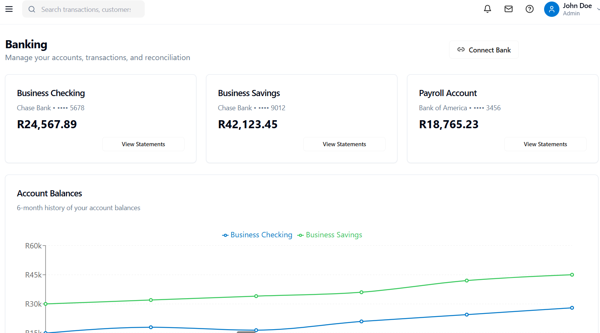

# Banking Module – CSV Import Plan

This document outlines a phased, checkbox-driven plan to add CSV import functionality to the Banking module of the accounting system. The plan focuses on data integrity, user-friendliness, and robust audit trails.

## Goals
- Enable CSV uploads of bank transactions.
- Validate, transform, and preview data before import.
- Map CSV columns to accounting fields.
- Select import destinations (Journal Entries, Trial Balance, Chart of Accounts).
- Provide comprehensive error reporting and an audit trail.

## Scope
- Frontend UI for upload, mapping, preview, validation, and confirmation.
- Backend services for parsing, validation, staging, duplicate detection, transformations, and destination-specific import.
- Audit logging across the full workflow.

## Phases (Checklist)
- [x] Phase 1: Requirements & Solution Design
- [x] Phase 2: CSV Parsing & Validation Layer
- [x] Phase 3: Column Mapping UI & Rules
- [x] Phase 4: Preview, Editing & Staging
- [x] Phase 5: Import Destinations Integration
- [x] Phase 6: Confirmation, Commit & Audit
- [x] Phase 7: Security, Performance & Reliability
- [x] Phase 8: Testing, QA & Documentation
- [ ] Phase 9: Rollout, Training & Support

---

## Phase 1: Requirements & Solution Design
- Define supported CSV formats (delimiter `,` default; support `;` and `\t`; UTF-8 only).
- Specify required/optional fields: `date`, `description`, `amount` or `debit`+`credit`, `account code` (optional), `reference` (optional).
- Establish validation rules: date formats (`YYYY-MM-DD`, `DD/MM/YYYY`), numeric amounts, allowed currencies, account code patterns.
- Choose transformation rules: negative amounts => credit; combine debit/credit to signed amount; trim whitespace; normalize case.
- Duplicate detection strategy: hash of `(date, description, amount, account, reference)`; configurable similarity for fuzzy matches.
- Data model design: ImportSession, ImportMappingTemplate, StagedTransaction, ImportError, ImportAuditEvent.
- Error taxonomy: parse errors, missing required field, invalid format, unknown account code, duplicate suspected, mapping incomplete.
- UX flow alignment with user workflow; draft wireframes for: Upload, Mapping, Preview, Destinations selection, Summary, Results.
- Define idempotency and rollback behavior per destination.

Deliverables
- Requirements spec and ERD additions for import-related entities.
- Wireframe set and UX copy guidelines.
- Non-functional requirements (performance, security, privacy, auditability).

Acceptance
- Stakeholders sign off on specs, UX flow, validations, and transformations.

---

## Phase 2: CSV Parsing & Validation Layer
- Implement backend CSV ingestion with streaming parsing to support large files (e.g., 100k+ rows).
- Perform header detection and normalization; auto-detect delimiter; handle quoted fields.
- Row-level validation: date parsing, amount parsing, account code format, currency code validation, empty field checks.
- Implement transformation pipeline: whitespace trim, normalize signs, coalesce debit/credit into signed amount, canonicalize dates.
- Duplicate detection: compute stable row hash; check against historical imports and existing ledger where applicable.
- Error collection: associate errors with row indices and fields; aggregate summary metrics.
- Return structured response to UI with parsed headers, sample rows, validation status, and error/duplicate flags.

Deliverables
- Parsing/validation service with API endpoints for upload and analysis.
- Schema for validation results and error reporting.

Acceptance
- Correctly parses representative CSVs; produces consistent validation and duplicate flags; handles large files under defined resource limits.

---

## Phase 3: Column Mapping UI & Rules
- Mapping UI to assign CSV headers to system fields: date, description, amount or debit/credit, account code, reference, currency.
- Provide smart suggestions based on header heuristics and past templates (per bank/vendor).
- Enforce required field mapping; display completeness indicator and unresolved warnings.
- Allow saving and loading `ImportMappingTemplate` per bank/account.
- Support custom transformation toggles: invert signs, merge columns, fixed currency/account defaults.

Deliverables
- Frontend mapping component and backend support for templates.

Acceptance
- Users can complete mapping quickly; suggestions are accurate for common bank CSVs; templates persist and reload.

---

## Phase 4: Preview, Editing & Staging
- Preview grid showing parsed rows with validation state (valid/invalid/duplicate).
- Inline editing: allow users to correct values (date, amount, account code, description) for flagged rows.
- Bulk actions: filter invalid rows, exclude selected rows from import, apply batch fixes (e.g., set account code).
- Staging: persist `StagedTransaction` with mapping, transformations, and user edits; maintain `ImportSession` status.
- Provide totals by period/account and reconciliation hints.

Deliverables
- Interactive preview UI and staging persistence.

Acceptance
- Users can review, edit, and stage data; totals and flags match expectations; changes persist across sessions.

---

## Phase 5: Import Destinations Integration
- Journal Entries
  - Create balanced entries per transaction or aggregated by date/account as configured.
  - Post proper debit/credit based on signed amount and mapped accounts.
  - Protect against duplicates via idempotency key (session+row hash).
- Trial Balance
  - Update balances by period/account from staged totals.
  - Ensure consistency with journal postings; reject if mismatch.
- Chart of Accounts
  - Map to existing accounts; provide suggestions where code/name nearly match.
  - Queue proposed new accounts for approval; do not auto-create without confirmation.

Deliverables
- Destination-specific import services with transactional guarantees.

Acceptance
- Imports create correct postings, maintain balance, and prevent double-posting; unknown accounts are handled via approval flow.

---

## Phase 6: Confirmation, Commit & Audit
- Summary screen: counts of valid/invalid/duplicates/excluded; totals by debit/credit; destination choices.
- Confirmation step with explicit user consent and checklist of selected destinations.
- Commit process with database transaction boundaries; partial failure handling and rollback.
- Audit trail: record `who`, `when`, `what` (file hash, mapping template id, transformations), `before/after` diffs for each destination.
- Generate Import Report: downloadable CSV/JSON/PDF with success rows, error rows, and actions taken.

Deliverables
- Commit pipeline, audit logging, and reporting.

Acceptance
- Auditable logs exist for every import; reports are accurate and complete; rollback works on failure.

---

## Phase 7: Security, Performance & Reliability
- Security
  - Role-based access control for Banking Import.
  - File type/size restrictions; server-side MIME verification; reject non-CSV.
  - Protect against CSV/Excel formula injection on any exports.
  - Sanitize descriptions to prevent injection; validate account codes against whitelist.
- Performance
  - Stream parsing with backpressure; chunked validation.
  - Progress indicator; cancel/resume support.
- Reliability
  - Idempotent imports; dedup keys; retry strategy for transient failures.
  - Clear failure states and rollback paths.

Deliverables
- Policy docs, safeguards in code, performance benchmarks.

Acceptance
- Meets defined SLAs for file size, throughput, memory; passes security review.

---

## Phase 8: Testing, QA & Documentation
- Unit tests: parser, validators, transformations, duplicate detection.
- Integration tests: mapping persistence, staging, destination imports with transactional behavior.
- E2E tests: full workflow across typical bank CSVs and edge cases.
- Test data sets: diverse CSV fixtures (different delimiters, headers, malformed rows).
- Documentation: user guide, admin guide (templates, approvals), troubleshooting.

Deliverables
- Test suites, fixtures, CI integration; user/admin docs.

Acceptance
- High coverage on critical paths; green CI; docs reviewed and approved.

---

## Phase 9: Rollout, Training & Support
- Feature flag and gradual rollout to selected users.
- In-app guides/tooltips and short tutorials.
- Telemetry and feedback collection; monitor errors and adoption.
- Support playbook and escalation paths.

Deliverables
- Rollout plan, training materials, telemetry dashboards, support SOPs.

Acceptance
- Successful staged rollout with minimal incidents; positive user feedback.

---

## User Workflow (Reference)
1. Upload CSV file.
2. Map CSV columns to system fields.
3. Preview and validate data; correct errors as needed.
4. Select import destination(s): Journal, Trial Balance, Chart of Accounts.
5. Review summary and confirm import.
6. View results with success/error report and audit log.

---

## Data Models (Proposed)
- ImportSession: id, userId, createdAt, fileName, fileHash, status, totals.
- ImportMappingTemplate: id, name, bank/vendor, header->field map, transforms.
- StagedTransaction: id, sessionId, normalized fields, validationStatus, duplicateFlag, editHistory.
- ImportError: id, sessionId, rowIndex, field, code, message.
- ImportAuditEvent: id, sessionId, actorId, timestamp, action, details.

---

## Validation Rules (Examples)
- Date: ISO or configured formats; reject future dates beyond configurable threshold.
- Amount: numeric; either `amount` or (`debit` and `credit`) required; zero not allowed unless flagged.
- Account Code: exists in Chart of Accounts; suggest closest match if not found.
- Currency: default from account; override allowed; must be ISO 4217.
- Description: trim, max length, printable characters only.

---

## Duplicate Detection
- Strict: exact match on `(date, description, amount, account, reference)`.
- Fuzzy: similarity on description with same date and amount; configurable threshold.
- Dedup policy: exclude duplicates by default; allow manual inclusion with note.

---

## Transformation Rules
- Negative amounts are credits; positive amounts are debits.
- If both debit/credit provided, derive signed `amount = debit - credit`.
- Normalize dates to ISO; trim whitespace; collapse multiple spaces.

---

## Import Destinations Behavior
- Journal Entries: per-transaction or batched by date/account; enforce balancing.
- Trial Balance: recompute period totals; verify consistency with journal.
- Chart of Accounts: non-existent accounts flagged for approval; suggestions provided.

---

## Audit & Logging
- Record all user actions and system transformations with timestamps and actor IDs.
- Store file hash and mapping template reference for reproducibility.
- Maintain before/after snapshots for committed changes.
- Provide downloadable reports of errors, decisions, and outcomes.

---

## Security & Compliance
- Access restricted to roles with Banking Import permission.
- Input sanitation and safe handling of CSV content.
- Logging aligns with privacy requirements; avoid storing sensitive PII unnecessarily.

---

## Testing Strategy
- Unit: validators, parsers, transformers, dedup hash.
- Integration: end-to-end staging to destination commit.
- E2E: browser-based workflow across large and malformed CSVs.

---

## Telemetry & Metrics
- Imports attempted/completed, error rates, duplicate rates.
- Time to import, file sizes, rows processed per second.
- User friction points (mapping edits, corrections per import).

---

## Risks & Mitigations
- Large files exceeding memory: use streaming and chunked validation.
- Bank format variability: mapping templates and robust heuristics.
- Duplicate posting risk: idempotent keys and strict dedup.
- Unknown accounts: approval workflow and suggestions.

---

## Success Criteria
- Users import typical bank CSVs with minimal friction.
- Data imports are correct, balanced, and auditable.
- System scales to large files without errors; strong user satisfaction.