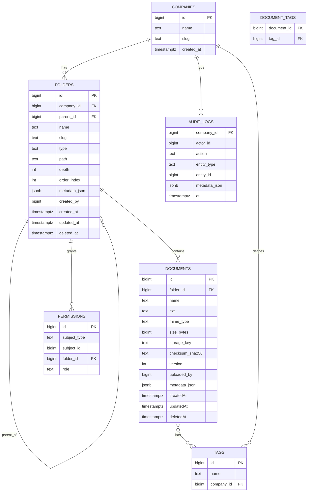
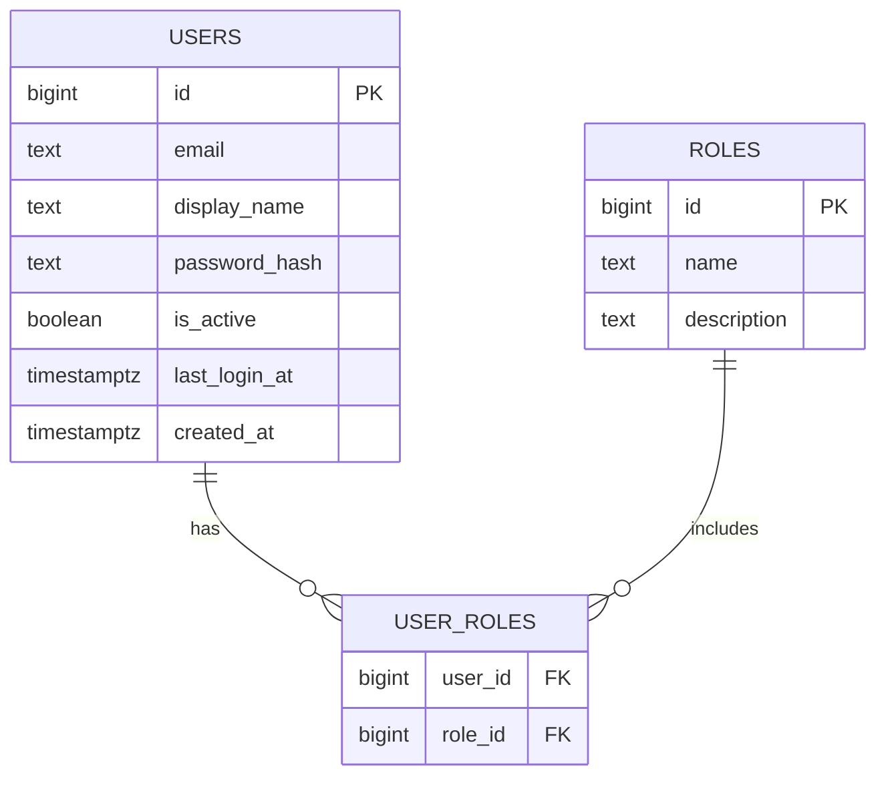
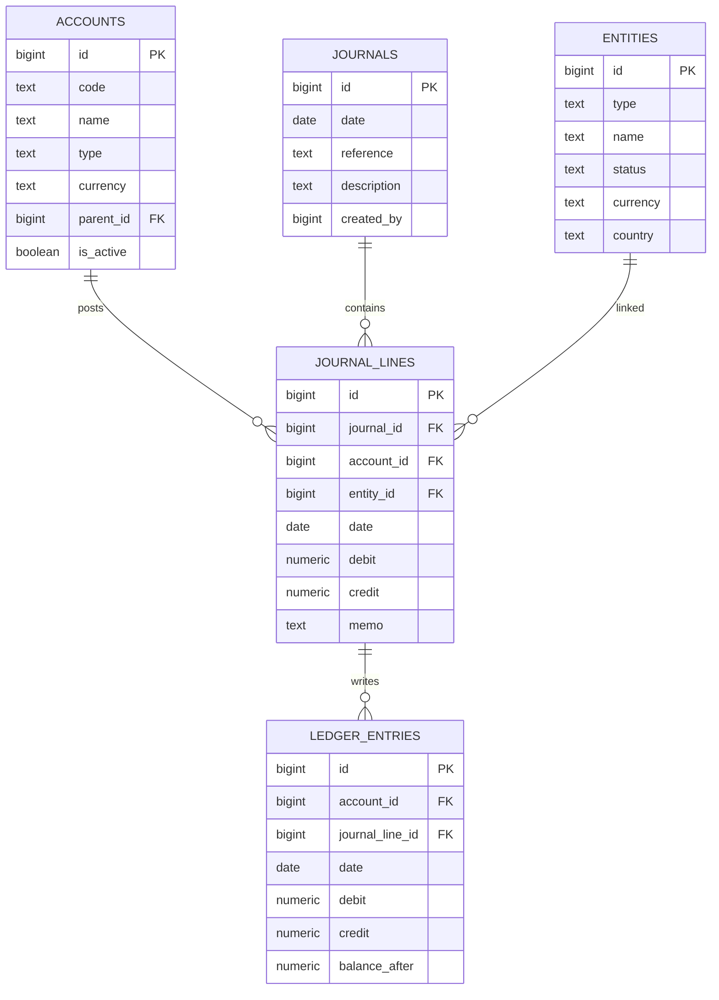

# Data Model – Source of Truth (Updated)

Purpose: centralize the application’s data model across database schemas, service models, migrations, and environment/runtime connectivity. This document is maintained alongside migrations and backend changes.

## Scope
- Database: `dms` schema (companies, folders, documents, permissions, tags, document_tags, audit_logs), Banking Import schema, and Accounting schema used by routes.
- Auth: active `app.*` schema (`users`, `roles`, `user_roles`) used by backend routes for login and RBAC. Legacy `auth.*` is not used.
- Services: backend routes and payloads for Auth, Administration (Users), Documents/Folders, Banking Import, and Accounting.
- UI: DMS store entities and Banking import models.

## Conventions
- Schema prefix: `dms` for Document Management System tables.
- Auth schema: backend uses `app.*` for users/roles mapping. Reserved `auth` schema is not used by routes or login.
- Soft-deletes via `deleted_at` on folder and document records; queries exclude soft-deleted rows by default.
- Materialized path: folders store hierarchical path in `folders.path` (e.g., `/1/34/78`) and `depth` for fast filters.
- RBAC: JWT-based roles (`admin`, `accountant`, `editor`, `viewer`). A fallback header `X-Role` may be supported in some clients during transition.
- JSON fields: flexible metadata stored in `*_json` columns where noted.

## Environment & Connectivity (Runtime)
- Connectors:
  - `req.pg` (Postgres Pool) for `app.*` auth tables and role resolution.
  - `req.db` (Supabase client) for `dms.*`, `accounting.*`, and `banking.*` tables.
- Env vars (Postgres):
  - Preferred single URL: `DATABASE_URL` or `SUPABASE_DB_URL` (e.g., `postgresql://<user>:<urlencoded-password>@<host>:5432/<db>?sslmode=require`).
  - Fallback discrete vars: `PGHOST`, `PGPORT`, `PGUSER`, `PGPASSWORD`, `PGDATABASE` (+ optional `PGSSL=true`).
  - SSL: enabled automatically if `sslmode=require` in the URL, or when `PGSSL=true` is set.
  - Dev TLS: when SSL is required, the backend relaxes TLS verification in dev by setting `NODE_TLS_REJECT_UNAUTHORIZED=0` to avoid self-signed chain errors with Supabase. Do not rely on this in production; instead provide proper CA or managed certs.
- Env vars (Supabase): `SUPABASE_URL`, `SUPABASE_SERVICE_ROLE_KEY` (server); `VITE_SUPABASE_URL`, `VITE_SUPABASE_ANON_KEY` (client).
- Loading env: `dotenv/config` is imported in `backend/src/index.ts` and `backend/src/middleware/pg.ts` so both the server and PG pool creation see `.env` variables reliably.
- Server port: `API_PORT` (default `3001`) is supported for running multiple local instances (e.g., `3003`).

## Migrations & Seeding (Auth)
- Active app migrations:
  - `005_app_init.sql` – creates `app.users`, `app.roles`, `app.user_roles` with required constraints.
  - `006_app_seed_admin.sql` – seeds core roles and an initial admin user into `app.*` directly; includes a safeguard `ALTER TABLE app.roles ADD COLUMN description TEXT` if missing.
- Migration runner: `backend/scripts/migrate_app.ts` updated to remove legacy `003_auth_init.sql` and `004_auth_seed_admin.sql`, and include `006_app_seed_admin.sql` for Supabase-compatible seeding.
- Seeded data (verified):
  - Roles: `admin`, `accountant`, `editor`, `viewer` (with optional `description`).
  - Admin user: `admin@mmfs.co.za`, display name `System Administrator`, active, with `admin` role.
  - Password hashing: `bcryptjs` with 10 rounds; seeded admin password `P@sswordMMFSadmin` was hashed prior to insertion.

## Database Schema (Current)

### Schema: `dms`

- `companies`
  - `id` BIGSERIAL PK
  - `name` TEXT NOT NULL
  - `slug` TEXT UNIQUE
  - `created_at` TIMESTAMPTZ DEFAULT NOW()

- `folders`
  - `id` BIGSERIAL PK
  - `company_id` BIGINT REFERENCES `companies(id)`
  - `parent_id` BIGINT REFERENCES `folders(id)`
  - `name` TEXT NOT NULL
  - `slug` TEXT
  - `type` `folder_type` ENUM (`company`, `country`, `cedant`, `category`, `treaty_section`, `generic`)
  - `path` TEXT NOT NULL
  - `depth` INT NOT NULL DEFAULT 0
  - `order_index` INT DEFAULT 0
  - `metadata_json` JSONB DEFAULT '{}'::jsonb
  - `created_by` BIGINT
  - `created_at` TIMESTAMPTZ DEFAULT NOW()
  - `updated_at` TIMESTAMPTZ
  - `deleted_at` TIMESTAMPTZ
  - Constraints/Indexes:
    - Unique (`company_id`, `parent_id`, `name`) (soft-deletes excluded in queries)
    - Index on `path` for prefix queries – trigram GIN (`gin_trgm_ops`) per migrations

- `documents`
  - `id` BIGSERIAL PK
  - `folder_id` BIGINT REFERENCES `folders(id)`
  - `name` TEXT NOT NULL
  - `ext` TEXT
  - `mime_type` TEXT
  - `size_bytes` BIGINT
  - `storage_key` TEXT UNIQUE
  - `checksum_sha256` TEXT
  - `version` INT DEFAULT 1
  - `uploaded_by` BIGINT
  - `metadata_json` JSONB DEFAULT '{}'::jsonb
  - `created_at` TIMESTAMPTZ DEFAULT NOW()
  - `updated_at` TIMESTAMPTZ
  - `deleted_at` TIMESTAMPTZ
  - Indexes: `folder_id`, `storage_key`, `checksum_sha256`
  - Notes: backend routes support metadata updates and expect `metadata_json`.

- `permissions`
  - `id` BIGSERIAL PK
  - `subject_type` TEXT NOT NULL
  - `subject_id` BIGINT NOT NULL
  - `folder_id` BIGINT REFERENCES `folders(id)`
  - `role` TEXT NOT NULL CHECK (role IN ('admin','accountant','editor','viewer'))
  - Index: (`subject_type`, `subject_id`, `folder_id`)

- `tags`
  - `id` BIGSERIAL PK
  - `name` TEXT NOT NULL
  - `company_id` BIGINT REFERENCES `companies(id)`
  - Constraint: UNIQUE (`company_id`, `name`)

- `document_tags`
  - `document_id` BIGINT REFERENCES `documents(id)`
  - `tag_id` BIGINT REFERENCES `tags(id)`
  - PK: (`document_id`, `tag_id`)

- `audit_logs`
  - `company_id` BIGINT REFERENCES `companies(id)`
  - `actor_id` BIGINT
  - `action` TEXT NOT NULL
  - `entity_type` TEXT NOT NULL
  - `entity_id` BIGINT NOT NULL
  - `metadata_json` JSONB DEFAULT '{}'::jsonb
  - `at` TIMESTAMPTZ DEFAULT NOW()

### Schema: `app` (actively used by backend)

- `users`
  - `id` BIGSERIAL PK
  - `email` TEXT UNIQUE NOT NULL
  - `display_name` TEXT
  - `password_hash` TEXT NOT NULL
  - `is_active` BOOLEAN DEFAULT TRUE
  - `last_login_at` TIMESTAMPTZ
  - `created_at` TIMESTAMPTZ DEFAULT NOW()

- `roles`
  - `id` BIGSERIAL PK
  - `name` TEXT UNIQUE NOT NULL CHECK (name IN ('admin','accountant','editor','viewer'))
  - `description` TEXT  -- present; added by safeguard during seeding if missing

- `user_roles`
  - `user_id` BIGINT REFERENCES `users(id)`
  - `role_id` BIGINT REFERENCES `roles(id)`
  - PK: (`user_id`, `role_id`)

Notes:
- Passwords hashed via `bcryptjs`; backend verifies on login.
- Admin seeding ensures an initial active admin user with the `admin` role.

### Schema: `accounting` (used by routes; migrations maintained separately)

- `entities` (`id`, `type`, `name`, `status`, `currency`, `country`, `email`, `phone`, `notes`, timestamps)
- `accounts` (`id`, `code` UNIQUE, `name`, `type`, `currency`, `parent_id`, `is_active`, timestamps)
- `journals` (`id`, `date`, `reference`, `description`, `created_by`, timestamps)
- `journal_lines` (`id`, `journal_id`, `account_id`, `entity_id`, `date`, `debit`, `credit`, `memo`)
- `ledger_entries` (`id`, `account_id`, `journal_line_id`, `date`, `debit`, `credit`, `balance_after`, timestamps)
- Reporting tables and views: `trial_balance_snapshots`, `v_trial_balance_current`, etc.

## Service Models

- Folder API
  - Endpoints: `/api/v1/folders/*` (also mirrored under `/api/v1/accounting/documents/*`).
  - Models: `FolderDTO`, `FolderChildrenDTO[]`, `FolderTreeDTO`.

- Document API
  - Endpoints: `/api/v1/documents/*` (also mirrored under `/api/v1/accounting/documents/*`).
  - Models: `DocumentDTO`, `DocumentVersionDTO[]`, `SignedUrlDTO`.
  - Notes: `PATCH` supports rename and metadata (`metadata_json`).

- Banking Import API
  - Endpoints: `/api/v1/banking/import/*`.
  - Models: `ImportSession`, `ImportMappingTemplate`, `NormalizedTransaction`, `ImportError`, `ImportAuditEvent`, `DestinationSelection`, `CommitResult`.

- Accounting API
  - Endpoints: `/api/v1/accounting/*`.
  - Models: `EntityDTO`, `AccountDTO`, `JournalDTO`, `JournalLineDTO`, `LedgerEntryDTO`, `TrialBalanceRowDTO`.
  - RPC: `fn_post_journal(...) -> bigint` – posts a balanced journal and writes ledger entries.

- Authentication API
  - Endpoint: `POST /api/v1/auth/login`.
  - Request: `{ email: string, password: string }`.
  - Response: `{ accessToken: string, user: { id, email, displayName?, roles[] }, role: string }`.
  - JWT: includes `roles` claim and `role` (highest). Secret from `JWT_SECRET` (defaults to `dev-secret-change-me` in dev).
  - Behavior: verifies credentials against `app.users`, resolves roles from `app.user_roles` and `app.roles`, updates `last_login_at`.

## ERDs

### ERD – Database (`dms`)

### ERD – App Auth

### ERD – Accounting (Current)

## Change Log

- v0.1 Baseline
  - Established `dms` schema with `companies`, `folders`, `documents`, `permissions`, `tags`, `document_tags`, `audit_logs`.
  - Seeded sample data; implemented folder/document routes and Supabase storage provider (partial).
  - Added RBAC middleware; roles `admin`, `editor`, `viewer`.

- v0.2 Banking Import
  - Created `banking` schema: sessions, templates, transactions, errors, audit events.
  - Implemented endpoints for sessions, analyze, stage, edit row, commit, templates.
  - Idempotency via unique (`session_id`, `row_hash`).

- v0.3 Accounting Functions & Reports
  - Added `public.fn_post_journal` RPC and `accounting.v_trial_balance_current` view.
  - Implemented endpoints for entities, accounts, journals, ledger, trial balance.

- v0.4 Auth Schema Alignment
  - Backend standardized on `app.*` for users/roles mapping; legacy `auth.*` migrations retained but not used.

- v0.5 Auth Fix & Supabase Compatibility (current)
  - Added `005_app_init.sql` and `006_app_seed_admin.sql` migrations; seeded roles and admin directly into `app.*`.
  - Updated migration runner to remove legacy `003_auth_init.sql` and `004_auth_seed_admin.sql`.
  - PG middleware now imports `dotenv/config`, prefers `SUPABASE_DB_URL`/`DATABASE_URL`, falls back to discrete `PG*` vars, and enables SSL when required.
  - Dev TLS relaxed (`NODE_TLS_REJECT_UNAUTHORIZED=0`) when SSL is required, avoiding self-signed chain errors with Supabase in local dev.
  - Verified login endpoint returns JWT and role mapping for seeded admin.

## Consistency Notes & Alignment Plan

- Auth schema: complete – backend uses `app.*`; seeding in `006_app_seed_admin.sql` ensures roles and an initial admin. Legacy `auth.*` not used by routes.
- DMS schema namespacing: backend queries `dms.folders`/`dms.documents` via `req.db`. Ensure migrations maintain schema prefixing and indexes (e.g., trigram GIN on `path`).
- Columns parity: `dms.documents` includes `metadata_json` and backend expects it for metadata updates.

## References
- Migrations: `backend/migrations/sql/005_app_init.sql`, `backend/migrations/sql/006_app_seed_admin.sql`.
- Migration runner: `backend/scripts/migrate_app.ts`.
- Middleware: `backend/src/middleware/pg.ts`, `backend/src/middleware/supabase.ts`.
- Server: `backend/src/index.ts`, `backend/src/server.ts`.
- Routes: `backend/src/routes/auth.ts`, `backend/src/routes/admin_users.ts`, `backend/src/routes/folders.ts`, `backend/src/routes/documents.ts`, `backend/src/routes/banking_import.ts`, `backend/src/routes/accounting.ts`.
- OpenAPI: `docs/openapi.yaml`.