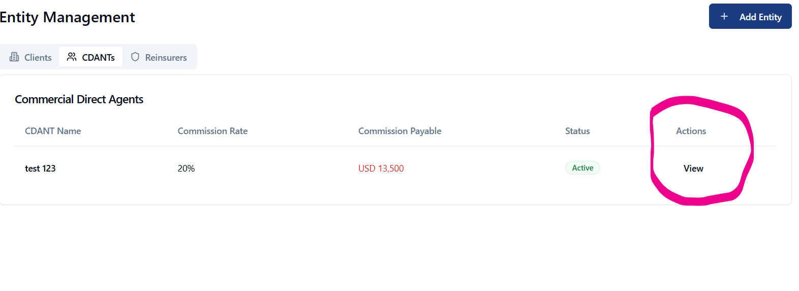
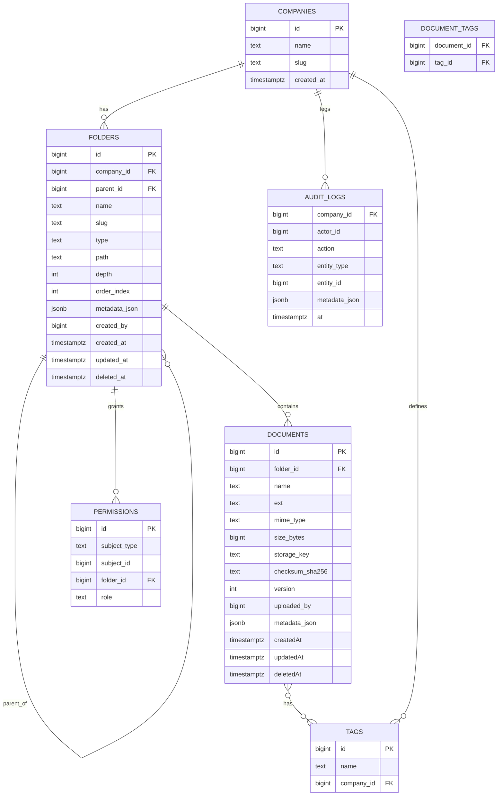
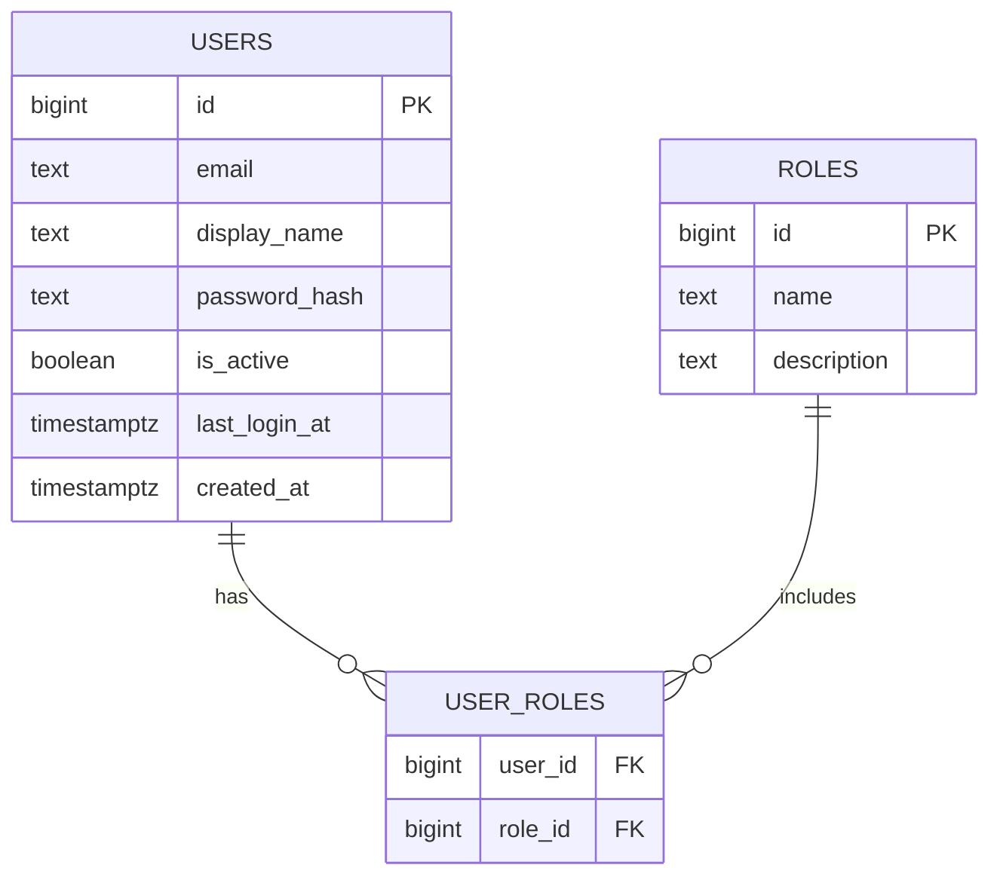
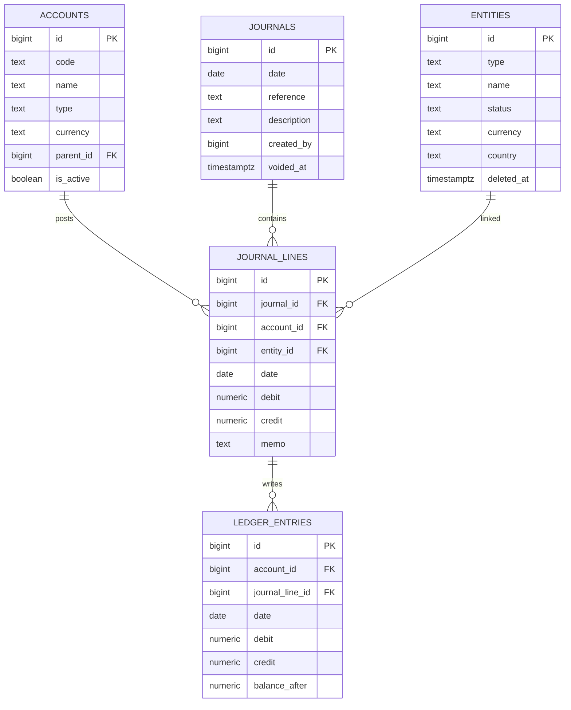
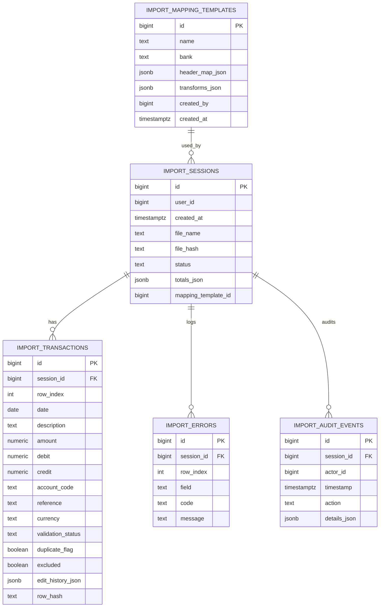

# Data Model – Source of Truth (Updated)

Purpose: centralize the application’s data model across database schemas, service models, migrations, and environment/runtime connectivity. This document is maintained alongside migrations and backend changes.

## Scope
- Database: `dms` schema (companies, folders, documents, permissions, tags, document_tags, audit_logs), Banking Import schema, and Accounting schema used by routes.
- Auth: active `app.*` schema (`users`, `roles`, `user_roles`) used by backend routes for login and RBAC. Legacy `auth.*` is not used.
- Services: backend routes and payloads for Auth, Administration (Users), Documents/Folders, Banking Import, and Accounting.
- UI: DMS store entities and Banking import models.

## Conventions
- Schema prefix: `dms` for Document Management System tables.
- Auth schema: backend uses `app.*` for users/roles mapping. Reserved `auth` schema is not used by routes or login.
- Soft-deletes via `deleted_at` on folder, document, and accounting entity records; queries exclude soft-deleted rows by default.
- Materialized path: folders store hierarchical path in `folders.path` (e.g., `/1/34/78`) and `depth` for fast filters.
- RBAC: JWT-based roles (`admin`, `accountant`, `editor`, `viewer`). A fallback header `X-Role` may be supported in some clients during transition.
- JSON fields: flexible metadata stored in `*_json` columns where noted.

## Environment & Connectivity (Runtime)
- Connectors:
  - `req.pg` (Postgres Pool) for `app.*` auth tables and role resolution.
  - `req.db` (Supabase client) for `dms.*`, `banking.*`, and accounting access via public views/RPC (`public.accounting_*` views, `public.fn_*` functions). Core writes use RPC; reads use public views. Server-side code may still query `accounting.*` directly where needed.
- Env vars (Postgres):
  - Preferred single URL: `DATABASE_URL` or `SUPABASE_DB_URL` (e.g., `postgresql://<user>:<urlencoded-password>@<host>:5432/<db>?sslmode=require`).
  - Fallback discrete vars: `PGHOST`, `PGPORT`, `PGUSER`, `PGPASSWORD`, `PGDATABASE` (+ optional `PGSSL=true`).
  - SSL: enabled automatically if `sslmode=require` in the URL, or when `PGSSL=true` is set.
  - Dev TLS: when SSL is required, the backend relaxes TLS verification in dev by setting `NODE_TLS_REJECT_UNAUTHORIZED=0` to avoid self-signed chain errors with Supabase. Do not rely on this in production; instead provide proper CA or managed certs.
- Env vars (Supabase): `SUPABASE_URL`, `SUPABASE_SERVICE_ROLE_KEY` (server); `VITE_SUPABASE_URL`, `VITE_SUPABASE_ANON_KEY` (client).
 - Supabase REST: ensure “Exposed schemas” includes `public` so the Data API can select `public.accounting_*` views. Without this, `/api/v1/accounting/*` reads may return 500 with `DB_ERROR`.
- Loading env: `dotenv/config` is imported in `backend/src/index.ts` and `backend/src/middleware/pg.ts` so both the server and PG pool creation see `.env` variables reliably.
- Server port: `PORT` (default `3000`). Static assets are served from `dist/` in production with a catch‑all to `index.html`. Socket.IO is mounted at `/api/socket.io`.

## Backend Architecture & Middleware
- Server: Express app (`backend/src/server.ts`) with Socket.IO attached in `backend/src/index.ts`.
- Static: Serves `dist/` and falls back to SPA route handler.
- Middleware:
  - `pgMiddleware` → attaches `req.pg` (Node pg Pool) for `app.*`; SSL when required; relaxes TLS in dev.
  - `supabaseMiddleware` → attaches `req.db`/`req.supabase` client and `req.storage` (Supabase Storage).
  - `authorize` → role-based guard using JWT (`roles[]`, `role`) with `X-Role` fallback; role rank admin > accountant/editor > viewer.
  - `errorHandler` → unified `{ error: { code, message } }` responses.
  - CORS + JSON body parsing enabled globally.

## Realtime
- Socket.IO path: `/api/socket.io`.
- Event: `accounting:fetchRefs` → returns `{ entities, accounts }` via `public.accounting_entities` and `public.accounting_accounts` (excludes soft-deleted entities).
- Auth: JWT from `handshake.auth.token` or `Authorization` header; `X-Role` fallback supported.

## Storage
- Provider: Supabase Storage (bucket `dms-documents`).
- Operations: upload, download, delete, and signed URLs (default 3600s). See `backend/src/storage/providers/SupabaseProvider.ts`.

## Migrations & Seeding (Auth)
- Active app migrations:
  - `005_app_init.sql` – creates `app.users`, `app.roles`, `app.user_roles` with required constraints.
  - `006_app_seed_admin.sql` – seeds core roles and an initial admin user into `app.*` directly; includes a safeguard `ALTER TABLE app.roles ADD COLUMN description TEXT` if missing.
- Migration runner: `backend/scripts/migrate_app.ts` updated to remove legacy `003_auth_init.sql` and `004_auth_seed_admin.sql`, and include `006_app_seed_admin.sql` for Supabase-compatible seeding.
- Seeded data (verified):
  - Roles: `admin`, `accountant`, `editor`, `viewer` (with optional `description`).
  - Admin user: `admin@mmfs.co.za`, display name `System Administrator`, active, with `admin` role.
  - Password hashing: `bcryptjs` with 10 rounds; seeded admin password `P@sswordMMFSadmin` was hashed prior to insertion.

## Database Schema (Current)

### Schema: `dms`

- `companies`
  - `id` BIGSERIAL PK
  - `name` TEXT NOT NULL
  - `slug` TEXT UNIQUE
  - `created_at` TIMESTAMPTZ DEFAULT NOW()

- `folders`
  - `id` BIGSERIAL PK
  - `company_id` BIGINT REFERENCES `companies(id)`
  - `parent_id` BIGINT REFERENCES `folders(id)`
  - `name` TEXT NOT NULL
  - `slug` TEXT
  - `type` `folder_type` ENUM (`company`, `country`, `cedant`, `category`, `treaty_section`, `generic`)
  - `path` TEXT NOT NULL
  - `depth` INT NOT NULL DEFAULT 0
  - `order_index` INT DEFAULT 0
  - `metadata_json` JSONB DEFAULT '{}'::jsonb
  - `created_by` BIGINT
  - `created_at` TIMESTAMPTZ DEFAULT NOW()
  - `updated_at` TIMESTAMPTZ
  - `deleted_at` TIMESTAMPTZ
  - Constraints/Indexes:
    - Unique (`company_id`, `parent_id`, `name`) (soft-deletes excluded in queries)
    - Index on `path` for prefix queries – trigram GIN (`gin_trgm_ops`) per migrations

- `documents`
  - `id` BIGSERIAL PK
  - `folder_id` BIGINT REFERENCES `folders(id)`
  - `name` TEXT NOT NULL
  - `ext` TEXT
  - `mime_type` TEXT
  - `size_bytes` BIGINT
  - `storage_key` TEXT UNIQUE
  - `checksum_sha256` TEXT
  - `version` INT DEFAULT 1
  - `uploaded_by` BIGINT
  - `metadata_json` JSONB DEFAULT '{}'::jsonb
  - `created_at` TIMESTAMPTZ DEFAULT NOW()
  - `updated_at` TIMESTAMPTZ
  - `deleted_at` TIMESTAMPTZ
  - Indexes: `folder_id`, `storage_key`, `checksum_sha256`
  - Notes: backend routes support metadata updates and expect `metadata_json`.

- `permissions`
  - `id` BIGSERIAL PK
  - `subject_type` TEXT NOT NULL
  - `subject_id` BIGINT NOT NULL
  - `folder_id` BIGINT REFERENCES `folders(id)`
  - `role` TEXT NOT NULL CHECK (role IN ('Admin','Editor','Viewer'))
  - Index: (`subject_type`, `subject_id`, `folder_id`)

- `tags`
  - `id` BIGSERIAL PK
  - `name` TEXT NOT NULL
  - `company_id` BIGINT REFERENCES `companies(id)`
  - Constraint: UNIQUE (`company_id`, `name`)

- `document_tags`
  - `document_id` BIGINT REFERENCES `documents(id)`
  - `tag_id` BIGINT REFERENCES `tags(id)`
  - PK: (`document_id`, `tag_id`)

- `audit_logs`
  - `company_id` BIGINT REFERENCES `companies(id)`
  - `actor_id` BIGINT
  - `action` TEXT NOT NULL
  - `entity_type` TEXT NOT NULL
  - `entity_id` BIGINT NOT NULL
  - `metadata_json` JSONB DEFAULT '{}'::jsonb
  - `at` TIMESTAMPTZ DEFAULT NOW()

### Schema: `app` (actively used by backend)

- `users`
  - `id` BIGSERIAL PK
  - `email` TEXT UNIQUE NOT NULL
  - `display_name` TEXT
  - `password_hash` TEXT NOT NULL
  - `is_active` BOOLEAN DEFAULT TRUE
  - `last_login_at` TIMESTAMPTZ
  - `created_at` TIMESTAMPTZ DEFAULT NOW()

- `roles`
  - `id` BIGSERIAL PK
  - `name` TEXT UNIQUE NOT NULL CHECK (name IN ('admin','accountant','editor','viewer'))
  - `description` TEXT  -- present; added by safeguard during seeding if missing

- `user_roles`
  - `user_id` BIGINT REFERENCES `users(id)`
  - `role_id` BIGINT REFERENCES `roles(id)`
  - PK: (`user_id`, `role_id`)

Notes:
- Passwords hashed via `bcryptjs`; backend verifies on login.
- Admin seeding ensures an initial active admin user with the `admin` role.

### Schema: `accounting` (source tables)

- `entities` (`id`, `type`, `name`, `status`, `currency`, `country`, `email`, `phone`, `notes`, `created_at`, `updated_at`, `deleted_at`)
- `accounts` (`id`, `code` UNIQUE, `name`, `type`, `currency`, `parent_id`, `is_active`, `created_at`)
  - Note: `updated_at` may be absent in the deployed database.
- `journals` (`id`, `date`, `reference`, `description`, `created_by`, `created_at`, `voided_at`)
  - Note: `updated_at` may be absent in the deployed database.
- `journal_lines` (`id`, `journal_id`, `account_id`, `entity_id`, `date`, `debit`, `credit`, `memo`, `created_at`)
- `ledger_entries` (`id`, `account_id`, `journal_line_id`, `date`, `debit`, `credit`, `balance_after`, `created_at`)
- Reporting view: `v_trial_balance_current` (current balances per account).

### Schema: `banking` (import pipeline)

- `import_sessions` (`id`, `user_id`, `created_at`, `file_name`, `file_hash`, `status`, `totals_json`, `mapping_template_id`)
- `import_mapping_templates` (`id`, `name`, `bank`, `header_map_json`, `transforms_json`, `created_by`, `created_at`)
- `import_transactions` (
  `id`, `session_id`, `row_index`, `date`, `description`, `amount`, `debit`, `credit`, `account_code`, `reference`, `currency`,
  `validation_status`, `duplicate_flag`, `excluded`, `edit_history_json`, `row_hash`
)
- `import_errors` (`id`, `session_id`, `row_index`, `field`, `code`, `message`)
- `import_audit_events` (`id`, `session_id`, `actor_id`, `timestamp`, `action`, `details_json`)

Constraints & Indexes:
- Unique (`session_id`, `row_hash`) on `import_transactions` for idempotency.
- Filtered indexes recommended on `validation_status`, `duplicate_flag`, `excluded`.

Note: The backend uses the `banking` schema extensively; a formal migration for it is not yet part of `backend/scripts/migrate_app.ts` and should be added.

### Public Views (Accounting API surface)

- `public.accounting_entities` → selects all columns from `accounting.entities`.
- `public.accounting_accounts` → selects `id, code, name, type, currency, parent_id, is_active, created_at` from `accounting.accounts`.
- `public.accounting_journals` → selects `id, date, reference, description, created_by, created_at, voided_at` from `accounting.journals`.
- `public.accounting_journal_lines` → selects `id, journal_id, account_id, entity_id, date, debit, credit, memo, created_at` from `accounting.journal_lines`.
- `public.accounting_ledger_entries` → selects `id, account_id, journal_line_id, date, debit, credit, balance_after, created_at` from `accounting.ledger_entries`.
- `public.accounting_trial_balance_current` → alias for `accounting.v_trial_balance_current`.

Grants: `SELECT` on these views to `anon`, `authenticated`, and `service_role` for Supabase Data API access.
Note: Supabase API settings must expose the `public` schema to allow these views to be accessible via the Data API.

RPC functions (executed via Supabase Data API `rpc()`):
- `public.fn_create_entity`, `public.fn_update_entity` (entities CRUD helpers)
- `public.fn_create_account`, `public.fn_update_account` (accounts CRUD helpers)
- `public.fn_post_journal` (balanced journal posting)
- `public.fn_void_journal` (journal reversal + mark original as voided)

## Service Models

- Folder API
  - Endpoints: `/api/v1/documents/*` (also mirrored under `/api/v1/accounting/documents/*`).
  - Models: `FolderDTO`, `FolderChildrenDTO[]`, `FolderTreeDTO`.

- Document API
  - Endpoints: `/api/v1/documents/*` (also mirrored under `/api/v1/accounting/documents/*`).
  - Models: `DocumentDTO`, `DocumentVersionDTO[]`, `SignedUrlDTO`.
  - Notes: `PATCH` supports rename and metadata (`metadata_json`).

- Banking Import API
  - Endpoints:
    - `GET /api/v1/banking/import/sessions`
    - `POST /api/v1/banking/import/sessions`
    - `GET /api/v1/banking/import/sessions/:id`
    - `POST /api/v1/banking/import/sessions/:id/analyze`
    - `POST /api/v1/banking/import/sessions/:id/stage`
    - `PATCH /api/v1/banking/import/sessions/:id/rows/:rowId`
    - `POST /api/v1/banking/import/sessions/:id/commit`
    - `GET /api/v1/banking/import/templates`
    - `POST /api/v1/banking/import/templates`
  - Models: `ImportSession`, `ImportMappingTemplate`, `NormalizedTransaction`, `ImportError`, `ImportAuditEvent`, `DestinationSelection`, `CommitResult`.
  - Notes: Commit resolves `account_code` to `account_id`, can aggregate lines (by account), and posts a balanced journal via `public.fn_post_journal`.

- Accounting API
  - Endpoints: `/api/v1/accounting/*`.
  - Reads use public views; writes use RPC functions:
    - `GET /entities` → `public.accounting_entities` (excludes soft-deleted).
    - `GET /entities/:id` → single entity; 404 if soft-deleted.
    - `POST /entities` → `public.fn_create_entity(p_type, p_name, p_status?, p_currency?, p_country?, p_email?, p_phone?, p_notes?)` returns inserted row.
    - `PATCH /entities/:id` → `public.fn_update_entity(p_id, p_type?, p_name?, p_status?, p_currency?, p_country?, p_email?, p_phone?, p_notes?)` returns updated row.
    - `DELETE /entities/:id` → soft delete; blocked when referenced by `journal_lines`.
    - `GET /accounts` → `public.accounting_accounts`.
    - `GET /accounts/:id` → single account; 404 if not found.
    - `POST /accounts` → `public.fn_create_account(p_code, p_name, p_type, p_currency?, p_parent_id?, p_is_active?)` returns inserted row.
    - `PATCH /accounts/:id` → `public.fn_update_account(p_id, p_code?, p_name?, p_type?, p_currency?, p_parent_id?, p_is_active?)` returns updated row.
    - `DELETE /accounts/:id` → hard delete; blocked (409 Conflict) when referenced by `journal_lines`; requires `admin` or `accountant` role.
    - `POST /journals` → `public.fn_post_journal(p_date, p_reference?, p_description?, p_created_by?, p_lines jsonb[]) -> bigint` returns `journal_id`.
    - `GET /journals` → `public.accounting_journals` (filterable by `date` range, `status`).
    - `GET /journals/:id` → returns `{ journal, lines[] }` using `public.accounting_journals` and `public.accounting_journal_lines`.
    - `POST /journals/:id/void` → `public.fn_void_journal(p_journal_id, p_created_by, p_reason?) -> bigint` sets `voided_at` and returns `reversal_journal_id`.
    - `DELETE /journals/:id` → hard delete draft/reviewed journals; returns 409 for posted journals (must be voided instead); requires `admin` or `accountant` role.
    - `GET /ledger` → `public.accounting_ledger_entries` with optional filters and pagination:
      - Query params: `account_id?` (optional), `start?` (ISO date), `end?` (ISO date), `limit?` (default 50), `offset?` (default 0).
      - Returns: `{ items: LedgerEntryDTO[], total?: number }`.
      - Access: `admin`, `accountant`, `editor`, `viewer` roles.
      - Used by: General Ledger page (`/accounting/general-ledger`).
    - `GET /trial-balance` → `public.accounting_trial_balance_current`.
  - Models: `EntityDTO` (includes `deleted_at`), `AccountDTO`, `JournalDTO` (includes `voided_at`), `JournalLineDTO`, `LedgerEntryDTO` (includes `balance_after`), `TrialBalanceRowDTO`.

- Administration API
  - Endpoints: `/api/v1/administration/users`.
  - `GET /` → list users with roles.
  - `POST /` → create user (hash password, assign roles).
  - `PATCH /:id` → update user (name, is_active, password, roles).
  - RBAC: `admin` only.

- Authentication API
  - Endpoint: `POST /api/v1/auth/login`.
  - Request: `{ email: string, password: string }`.
  - Response: `{ accessToken: string, user: { id, email, displayName?, roles[] }, role: string }`.
  - JWT: includes `roles` claim and `role` (highest). Secret from `JWT_SECRET` (defaults to `dev-secret-change-me` in dev).
  - Behavior: verifies credentials against `app.users`, resolves roles from `app.user_roles` and `app.roles`, updates `last_login_at`.

## ERDs

### ERD – Database (`dms`)



### ERD – App Auth



### ERD – Accounting (Current)



### ERD – Banking Import (Current)



## Change Log

- v0.1 Baseline
  - Established `dms` schema with `companies`, `folders`, `documents`, `permissions`, `tags`, `document_tags`, `audit_logs`.
  - Seeded sample data; implemented folder/document routes and Supabase storage provider (partial).
  - Added RBAC middleware; roles `admin`, `editor`, `viewer`.

- v0.2 Banking Import
  - Created `banking` schema: sessions, templates, transactions, errors, audit events.
  - Implemented endpoints for sessions, analyze, stage, edit row, commit, templates.
  - Idempotency via unique (`session_id`, `row_hash`).

- v0.3 Accounting Functions & Reports
  - Added `public.fn_post_journal` RPC and `accounting.v_trial_balance_current` view.
  - Implemented endpoints for entities, accounts, journals, ledger, trial balance.

- v0.4 Auth Schema Alignment
  - Backend standardized on `app.*` for users/roles mapping; legacy `auth.*` migrations retained but not used.

- v0.5 Auth Fix & Supabase Compatibility (current)
  - Added `005_app_init.sql` and `006_app_seed_admin.sql` migrations; seeded roles and admin directly into `app.*`.
  - Updated migration runner to remove legacy `003_auth_init.sql` and `004_auth_seed_admin.sql`.
  - PG middleware now imports `dotenv/config`, prefers `SUPABASE_DB_URL`/`DATABASE_URL`, falls back to discrete `PG*` vars, and enables SSL when required.
  - Dev TLS relaxed (`NODE_TLS_REJECT_UNAUTHORIZED=0`) when SSL is required, avoiding self-signed chain errors with Supabase in local dev.
  - Verified login endpoint returns JWT and role mapping for seeded admin.

- v0.6 Public Accounting Views & RPC (current)
  - Added `009_accounting_api_views.sql` defining public views: `accounting_entities`, `accounting_accounts`, `accounting_journals`, `accounting_ledger_entries`, `accounting_trial_balance_current`.
  - Added RPC helpers: `public.fn_create_entity`, `public.fn_update_entity`, `public.fn_create_account`, `public.fn_update_account`; retained `public.fn_post_journal`.
  - Backend accounting routes updated to read via public views and write via RPC.
  - Note: in production DB, `updated_at` is present on `entities` but may be absent on `accounts` and `journals`; views reflect available columns.
  
- v0.6.1 Migration Idempotency & Supabase REST
  - Updated `backend/migrations/sql/007_accounting_init.sql` to drop `public.accounting_trial_balance_current` before `accounting.v_trial_balance_current` to avoid dependency error (Postgres `2BP01`) when re-running migrations.
  - Confirmed `009_accounting_api_views.sql` creates/grants public views; ensure Supabase Dashboard → Settings → API → “Exposed schemas” includes `public` so the Data API can read those views.
  - Validated `/api/v1/accounting/entities` and `/accounts` return 200 after the fix.

- v0.6.2 Accounting Actions & Endpoints (current)
  - Added `backend/migrations/sql/010_accounting_actions.sql`:
    - Added `deleted_at` to `accounting.entities` for soft-delete.
    - Added `voided_at` to `accounting.journals` to mark voided journals.
    - Created public view `public.accounting_journal_lines` and updated `public.accounting_journals` to include `voided_at`.
    - Granted `SELECT` on new/updated views to `anon`, `authenticated`, `service_role`.
    - Added RPC `public.fn_void_journal(p_journal_id, p_created_by, p_reason?) -> bigint` to post a balanced reversal and mark original as voided.
  - Backend routes:
    - `GET /api/v1/accounting/entities/:id` (404 if soft-deleted).
    - `DELETE /api/v1/accounting/entities/:id` (soft delete; blocked if referenced by `journal_lines`).
    - `GET /api/v1/accounting/journals/:id` returns `{ journal, lines[] }`.
    - `POST /api/v1/accounting/journals/:id/void` returns `{ reversal_journal_id }`.
    - `GET /api/v1/accounting/entities` excludes soft-deleted by default.

- v0.6.3 Actions UX alignment & RBAC fallback (current)
  - Confirmed backend `authorize` middleware allows `X-Role` header fallback in dev and resolves effective role from JWT when present.
  - Clarified accepted headers: `X-Role` (role name) and optional `x-user-id` used for `created_by` when posting/voiding journals via RPC.
  - No schema changes; existing `voided_at` on `accounting.journals` is used by clients to hide voided notes from list views.
  - Endpoint behaviors verified:
    - `GET /api/v1/accounting/journals/:id` returns `{ journal, lines[] }` as documented; consumed by the View modal.
    - `POST /api/v1/accounting/journals/:id/void` posts a balanced reversal and returns `{ reversal_journal_id }`, marking original with `voided_at`.
  - Error responses standardized by global error handler: `{ error: { code, message } }`.
  - RBAC: only `admin` and `accountant` roles may void; all roles may view.

- v0.7 Realtime & Storage Docs
  - Documented Socket.IO endpoint `/api/socket.io` and `accounting:fetchRefs` event.
  - Added storage details: Supabase bucket `dms-documents`, signed URL behavior.

- v0.7.1 Banking Schema (documentation)
  - Added `banking` schema tables to the data model; noted missing migration and idempotency constraint (`session_id,row_hash`).

- v0.7.2 Server Config Alignment
  - Corrected server port to `PORT` (default `3000`); clarified SPA static serving and catch‑all.

- v0.8 Chart of Accounts CRUD & Trial Balance Integration
  - Frontend enhancements:
    - Added `getTrialBalance()` to `src/lib/api/accounting.ts` with `TrialBalanceDTO` type.
    - `ChartOfAccounts.tsx` now fetches trial balance data via React Query and displays actual account balances from journal entries (replaces hardcoded `'R0.00'`).
    - Created `EditAccount.tsx` page component for editing existing accounts; loads account data and submits via `updateAccount()` API function.
    - Added route `/accounting/account/:id/edit` in `src/App.tsx`.
    - Improved error handling in `AccountDetail.tsx`: distinguishes 404 from other errors, displays account ID in error message.
    - Implemented delete account functionality with confirmation dialog (`AlertDialog` component) and proper error handling for accounts with transaction history.
  - Backend enhancements:
    - Added `DELETE /api/v1/accounting/accounts/:id` endpoint in `backend/src/routes/accounting.ts`.
    - Endpoint checks for references in `accounting.journal_lines` before deletion; returns 409 Conflict if account has transactions (prevents data integrity issues).
    - Hard delete (not soft delete) to maintain referential integrity; accounts without transactions can be permanently removed.
    - Requires `admin` or `accountant` role for deletion.
  - API client updates:
    - Added `updateAccount()` function with `UpdateAccountRequest` type to `src/lib/api/accounting.ts`.
    - Added `deleteAccount()` function to `src/lib/api/accounting.ts`.
  - UX improvements:
    - Edit button in Chart of Accounts now navigates to edit page (previously non-functional).
    - Delete button triggers confirmation dialog with warning message for system accounts.
    - Toast notifications for all CRUD operations (success/failure).
    - Account balances dynamically calculated from trial balance view.
  - Notes:
    - Trial balance calculation performed by existing `accounting.v_trial_balance_current` view accessed via `GET /trial-balance`.
    - Delete operation blocked with user-friendly error message if account has journal entries; suggests setting account to inactive instead.
    - Edit functionality preserves existing account data and allows modification of code, name, type, currency, and active status.

|- v0.9 Journal Workflow & Data Persistence
  - Database schema updates (Migration 011: `backend/migrations/sql/011_journal_workflow.sql`):
    - Added workflow columns to `accounting.journals`: `status TEXT (draft|reviewed|posted)`, `reviewed_at TIMESTAMPTZ`, `reviewed_by BIGINT`, `posted_at TIMESTAMPTZ`, `posted_by BIGINT`.
    - Default `status='draft'` for all new journals.
    - Updated `public.accounting_journals` view to expose workflow columns and computed `total_amount` (sum of debit from journal_lines).
  - Backend RPC functions (new in migration 011):
    - `public.fn_create_journal_draft(p_date, p_reference?, p_description?, p_created_by?, p_lines jsonb[]) -> bigint`: Creates draft (allows unbalanced, no ledger entries).
    - `public.fn_review_journal(p_journal_id, p_reviewed_by) -> void`: Marks draft as reviewed.
    - `public.fn_post_journal_from_draft(p_journal_id, p_posted_by) -> bigint`: Posts draft/reviewed to ledger after balance validation; writes ledger_entries and sets `status='posted'`.
    - Updated `public.fn_post_journal()`: Now sets `status='posted'` and `posted_at/posted_by` on insert (immediate posting; used by Banking Import).
  - Backend API routes (new endpoints in `backend/src/routes/accounting.ts`):
    - `POST /api/v1/accounting/journals/draft` (roles: admin, accountant, editor): Create draft journal via RPC.
    - `PATCH /api/v1/accounting/journals/:id/review` (roles: admin, accountant): Review draft via RPC.
    - `POST /api/v1/accounting/journals/:id/post` (roles: admin, accountant): Post from draft/reviewed via RPC; validates balance; returns 400 if unbalanced.
    - `GET /api/v1/accounting/journals?status=draft|reviewed|posted` (roles: admin, accountant, viewer): Filter journals by workflow status.
  - Frontend API client (`src/lib/api/accounting.ts`):
    - Extended `JournalDTO` type with workflow fields: `status?`, `reviewed_at?`, `reviewed_by?`, `posted_at?`, `posted_by?`, `total_amount?`.
    - Updated `getJournals(params?: { start?, end?, status? })`: Now accepts optional `status` filter (draft|reviewed|posted).
    - Added `createJournalDraft(payload, role?, userId?)`: Create draft journal (allows unbalanced).
    - Added `reviewJournal(id, role?, userId?)`: Mark journal as reviewed.
    - Added `postJournalFromDraft(id, role?, userId?)`: Post draft/reviewed journal (requires balanced).
  - Frontend pages:
    - `src/pages/accounting/Journals.tsx`: 
      - Replaced hardcoded mock data with React Query powered `getJournals(status)` per active tab.
      - Tabs now filter by actual database status: "New Journals" (draft), "Reviewed Journals" (reviewed), "Posted Journals" (posted).
      - Displays real journal data: date, reference, description, total_amount; client-side search over fetched items.
      - Loading and error states for data fetching.
    - `src/pages/accounting/CreateJournal.tsx`:
      - Loads accounts from database via `getAccounts()` (displays "code - name" in dropdown, submits account_id).
      - "Save as Draft" button: Calls `createJournalDraft()` (allows unbalanced; does not require 2 lines).
      - "Create Journal" button: Calls `postJournal()` (immediate ledger posting; requires balanced; requires 2+ lines).
      - Converts form debit/credit strings to numeric values for API payload.
      - Shows loading state while fetching accounts; disables buttons during submission.
      - Toast notifications for success/error on both draft save and journal post.
  - Notes:
    - Journals created via Banking Import use existing `fn_post_journal()` (immediate posting, `status='posted'`).
    - Draft journals allow unbalanced debit/credit and do not create ledger entries; ledger entries only written when posted.
    - `x-user-id` header used for `created_by`, `reviewed_by`, `posted_by` tracking.
    - Migration 009 and 011 use `DROP VIEW IF EXISTS CASCADE` for idempotency; safe to re-run.

|- v0.10 Journal Actions: Review, Delete, Void
  - Backend API enhancements (`backend/src/routes/accounting.ts`):
    - `DELETE /api/v1/accounting/journals/:id` (roles: admin, accountant): Hard delete draft/reviewed journals; returns 409 for posted journals (must be voided instead).
      - Deletes journal_lines first, then journal record.
      - Guards against deleting posted journals to maintain ledger integrity.
    - Improved error handling for workflow RPCs:
      - `PATCH /journals/:id/review`: Maps "not found" and "not in draft" errors to HTTP 400 (was 500).
      - `POST /journals/:id/void`: Maps "not found" and "already voided" errors to HTTP 400 (was 500).
      - Returns structured error responses: `{ code, message }` for better client-side handling.
  - Frontend API client (`src/lib/api/accounting.ts`):
    - Added `deleteJournal(id, role?)`: Delete draft/reviewed journals via DELETE endpoint.
    - Existing `voidJournal(id, reason?, role?, userId?)`: Void posted journals (creates reversal).
  - Frontend pages (`src/pages/accounting/Journals.tsx`):
    - Batch actions fully implemented:
      - "Mark as Reviewed" button: Calls `reviewJournal()` for selected draft journals, switches to Reviewed tab, shows success/error toasts.
      - "Delete" button: Intelligently handles mixed selections:
        - Draft/Reviewed journals: Calls `deleteJournal()` (hard delete).
        - Posted journals: Calls `voidJournal()` (creates reversal, marks original as voided).
        - Shows separate success toasts for deleted vs voided journals.
      - Enhanced error display: Extracts and shows specific error messages from failed API calls.
      - Loading states: Buttons disabled during batch operations.
    - Selection management: Tracks selected journal IDs and their statuses across tabs for proper action routing.
    - Query invalidation: Refetches journal lists after successful actions to reflect changes.
  - Documentation & Testing:
    - `backend/JOURNAL_ACTIONS_RUNBOOK.md`: Comprehensive troubleshooting guide with migration verification, API testing commands (curl), database queries, common issues/fixes, and QA checklist.
    - `backend/scripts/verify_migrations.sql`: SQL script to verify all required RPC functions and workflow columns exist.
    - `backend/scripts/test_journal_actions.ts`: Integration tests for create→review→delete and create→post→void flows.
    - `JOURNAL_ACTIONS_FIX_SUMMARY.md`: Quick reference for applying fixes and testing.
  - Error handling improvements:
    - Backend returns 400 (not 500) for expected workflow violations (e.g., reviewing non-draft, voiding already-voided).
    - Frontend displays specific server error messages in toasts instead of generic failures.
    - 409 Conflict for attempting to delete posted journals (guides user to void instead).
  - Notes:
    - Migrations 010 and 011 must be applied for workflow functions to exist (`npm run db:migrate:app`).
    - Posted journals cannot be deleted; they must be voided to maintain audit trail and ledger integrity.
    - Voided journals remain in database with `voided_at` timestamp; reversal journal created with opposite debit/credit entries.
    - Batch operations use `Promise.allSettled()` to process all selected items even if some fail, reporting counts separately.

|- v0.11 General Ledger Live Data Implementation
  - Backend API enhancements (`backend/src/routes/accounting.ts`):
    - Enhanced `GET /api/v1/accounting/ledger` endpoint:
      - Made `account_id` parameter optional (was previously required).
      - Added pagination support: `limit` (default 50), `offset` (default 0).
      - Added `total` count in response for pagination UI: `{ items: LedgerEntryDTO[], total?: number }`.
      - Extended role access to include `editor` (was `admin`, `accountant`, `viewer`).
      - Uses Supabase `.range()` for efficient server-side pagination.
      - Supports combined filters: account + date range + pagination.
  - Frontend API client (`src/lib/api/accounting.ts`):
    - Added `LedgerEntryDTO` type: `{ id, account_id, journal_line_id, date, debit, credit, balance_after, created_at }`.
    - Added `getLedger(params, role?)` function with support for:
      - Optional `accountId` filter (number).
      - Optional `start`/`end` date filters (ISO format).
      - Optional `limit`/`offset` for pagination.
      - Returns `{ items: LedgerEntryDTO[], total?: number }`.
  - Frontend page (`src/pages/accounting/GeneralLedger.tsx`):
    - Complete rewrite: replaced 48-169 lines of static mock data with React Query powered live data.
    - Data fetching:
      - Uses `useQuery` from TanStack Query for accounts and ledger entries.
      - Automatic caching and refetching with `keepPreviousData` for smooth pagination.
      - Loading states with spinner, error states with user-friendly messages.
    - Filtering:
      - Account filter: Dropdown with all accounts from database (format: `{code} - {name}`).
      - Date range filter: Calendar picker with range selection (single date or date range).
      - Client-side search: Text search across account names and dates.
      - Filters reset pagination to page 1 on change.
    - Pagination:
      - Server-side pagination (50 entries per page).
      - Previous/Next buttons with disabled states.
      - Page indicator (e.g., "Page 1 of 5") and entry count display.
    - Display:
      - Account lookup map for efficient name resolution.
      - Currency formatting using `Intl.NumberFormat` (ZAR locale: `R1,234.56`).
      - Date formatting using `date-fns`.
      - Journal line ID display (e.g., `#101`).
      - Running balance display.
    - Totals:
      - Dynamic calculation for displayed entries: Total Debits, Total Credits, Net Change.
      - Color-coded net change (green for positive, red for negative).
      - Only shown when data is loaded and entries exist.
    - States: Loading, error, empty state with contextual messages; toast notifications for errors.
  - Testing:
    - Backend tests (`backend/scripts/test_ledger.ts`): 6 integration tests covering all filters, pagination, and edge cases.
    - Frontend tests (`src/pages/accounting/GeneralLedger.test.tsx`): 15 unit tests covering rendering, states, filters, and data display.
  - Documentation:
    - `docs/general-ledger-guide.md`: Comprehensive user guide with features, usage examples, technical details, troubleshooting, and database schema.
    - `GENERAL_LEDGER_IMPLEMENTATION_SUMMARY.md`: Complete implementation summary with architecture alignment, testing verification, and deployment notes.
  - Notes:
    - Page located at `/accounting/general-ledger`.
    - Access: `admin`, `accountant`, `editor`, `viewer` roles.
    - Totals calculated for current page only (not entire dataset) for performance.
    - Client-side search applied after server-side pagination.
    - Export button present but not yet implemented (placeholder for future).

|- v0.12 Trial Balance Live Data Implementation
  - Backend infrastructure (already existed, no changes required):
    - Database view `accounting.v_trial_balance_current` (from v0.6): Calculates balance as `SUM(debit) - SUM(credit)` per account, grouped by account ID/code/name/type.
    - Public API view `public.accounting_trial_balance_current` (from v0.6): Accessible via Supabase Data API with proper grants.
    - Endpoint `GET /api/v1/accounting/trial-balance` (from v0.6): Authorization for admin/accountant/viewer roles, returns `{ items: TrialBalanceDTO[] }`.
    - API client `getTrialBalance(role?)` (from v0.8): Type-safe with `TrialBalanceDTO`, role-based access control.
  - Frontend page (`src/pages/accounting/TrialBalance.tsx`):
    - Complete data layer refactor: replaced lines 50-112 of hardcoded mock data with React Query powered live data.
    - Data fetching:
      - Uses `useQuery` from TanStack Query for trial balance data.
      - Role-based access via `getPrimaryRole()`.
      - Error handling with `useEffect` and toast notifications (React Query v5 compatible).
      - Query key includes role for proper cache invalidation: `['trial-balance', role]`.
    - Data transformation with `useMemo`:
      - Groups flat account list by type into categories (Assets, Liabilities, Equity, Income, Expenses, Other).
      - Calculates debit/credit amounts based on account type and balance sign:
        - **Debit normal balance accounts** (Assets, Expenses): positive balance → debit column, negative balance → credit column.
        - **Credit normal balance accounts** (Liabilities, Equity, Income): positive balance → credit column, negative balance → debit column.
      - Computes category subtotals (totalDebit, totalCredit per category).
      - Calculates grand totals (grandTotalDebit, grandTotalCredit).
      - Category ordering: Assets, Liabilities, Equity, Income, Expenses, Other.
    - Helper functions:
      - `formatCurrency(amount)`: Formats numbers using `Intl.NumberFormat` for ZAR locale (R1,234.56 format).
      - `isDebitNormalBalance(type)`: Determines if account type has debit normal balance (Assets, Expenses).
      - `getCategoryFromType(type)`: Maps account type to category name.
    - Display features:
      - Currency formatting with ZAR locale throughout.
      - Conditional rendering: only show debit/credit values when >0.
      - Category collapsible rows with expand/collapse functionality.
      - Account detail rows with indentation under categories.
      - Grand totals row with formatted currency.
      - Bottom summary section showing Total Debits, Total Credits, and Difference.
      - Difference highlighted in red if debits ≠ credits (accounting error indicator).
    - States and error handling:
      - Loading state: Shows `Loader2` spinner with "Loading trial balance..." message.
      - Error state: Displays error message with retry suggestion, shows toast notification.
      - Empty state: Shows "No accounts found" message when no data.
      - Success state: Renders categorized table with live data.
    - UI functionality preserved:
      - Date picker (UI functional, can be extended for date filtering).
      - Trial balance type selector (Standard/Unadjusted/Adjusted - UI only).
      - Comparison period selector (UI only, future enhancement).
      - Expand/collapse all button (works with live data).
      - Collapsible categories with chevron icons.
      - Export button (placeholder for future implementation).
      - Back to Accounting navigation.
      - Trial balance explanation section.
    - Performance optimizations:
      - `useMemo` ensures data transformation only recalculates when `trialBalanceData` changes.
      - React Query caching with role-based query keys.
      - Conditional rendering of summary section (only when data exists).
  - Notes:
    - Page located at `/accounting/trial-balance`.
    - Access: `admin`, `accountant`, `viewer` roles.
    - No backend or API changes required; only frontend data layer updated.
    - Follows same patterns as General Ledger implementation (v0.11).
    - All mock data eliminated; 100% live database integration.
    - Accounting accuracy: Proper debit/credit placement based on account type and balance.
    - Grand totals always balance per accounting equation (debits = credits).
    - Handles contra accounts correctly (negative balances switch debit/credit columns).

|- v0.13 Trial Balance Filters & Excel Export Implementation
  - Database schema updates (Migration 012: `backend/migrations/sql/012_trial_balance_filters.sql`):
    - Created SQL function `accounting.fn_trial_balance_asof(p_as_of_date DATE)`:
      - Accepts date parameter (defaults to `CURRENT_DATE` if null)
      - Filters `ledger_entries` by `date <= p_as_of_date` to calculate historical balances
      - Returns same structure as `v_trial_balance_current`: `(account_id, code, name, type, balance)`
      - Includes only active accounts (`is_active = true`)
      - Granted execute permissions to `anon`, `authenticated`, `service_role` roles
    - Purpose: Enable trial balance queries at any specific date instead of only current balance
  - Backend API enhancements (`backend/src/routes/accounting.ts`):
    - Updated `GET /api/v1/accounting/trial-balance` endpoint (lines 358-409):
      - Accepts optional query parameter `asOfDate` (ISO date format: YYYY-MM-DD)
      - Validates date format and ensures not in future (returns 400 for invalid/future dates)
      - Added diagnostic check: verifies `accounting.fn_trial_balance_asof` exists in database before calling
      - Returns clear error message if migration 012 has not been run: `MIGRATION_MISSING` code with message "Trial balance function not found. Please run database migration 012."
      - Calls `accounting.fn_trial_balance_asof($1::DATE)` via `req.pg.query()`
      - Uses PostgreSQL Pool API pattern: `const result = await req.pg.query(...); res.json({ items: result.rows })` (not Supabase pattern)
      - Authorization: `admin`, `accountant`, `viewer` roles
    - New `GET /api/v1/accounting/trial-balance/export` endpoint (lines 411-575):
      - Accepts same `asOfDate` query parameter as main endpoint
      - Generates Excel workbook using `exceljs` library with professional formatting:
        - Sheet name: "Trial Balance"
        - Columns: Account Code, Account Name, Debit, Credit
        - Category groupings (Assets, Liabilities, Equity, Income, Expenses) with headers
        - Category subtotals in bold
        - Grand totals with gray background
        - Currency formatting (R#,##0.00) for all monetary values
        - Proper debit/credit placement based on account type and normal balance
      - Returns XLSX binary stream with proper headers:
        - `Content-Type: application/vnd.openxmlformats-officedocument.spreadsheetml.sheet`
        - `Content-Disposition: attachment; filename="trial-balance-YYYY-MM-DD.xlsx"`
      - Authorization: `admin`, `accountant`, `viewer` roles
  - Middleware improvements (`backend/src/middleware/errorHandler.ts`):
    - Enhanced error logging for better debugging:
      - Logs timestamp, HTTP status, request method, and path for all errors
      - Logs error code and message for all errors
      - For 500 errors (server errors), logs full stack trace and error object
      - Format: `[ISO timestamp] Error {status} on {METHOD} {path}`
      - Helps diagnose backend issues without direct console access
  - Frontend API client (`src/lib/api/accounting.ts`):
    - Updated `getTrialBalance()` function (lines 169-180):
      - New signature: `getTrialBalance(params?: { asOfDate?: string }, role: Role = 'accountant')`
      - Accepts optional params object with `asOfDate` property (ISO string format)
      - Builds query string from parameters: `/trial-balance?asOfDate=YYYY-MM-DD`
      - Maintains backward compatibility (params are optional)
    - Hardened `exportTrialBalance()` function (lines 182-221):
      - Signature: `exportTrialBalance(params?: { asOfDate?: string }, role: Role = 'accountant'): Promise<Blob>`
      - Added defensive error handling: safely retrieves access token with try-catch wrapper
      - Logs warnings if token retrieval fails but continues gracefully
      - Improved error message extraction from failed responses (supports multiple error structures)
      - Calls `/trial-balance/export` endpoint with same parameters
      - Returns Blob for file download (binary XLSX data)
      - Handles authentication via JWT token and `X-Role` header
      - Proper error handling with user-friendly error messages
  - Utility functions (`src/lib/utils.ts`):
    - Added new `sanitizeNumber(value: unknown): number` utility function:
      - Safely converts any value (number, string, null, undefined) to a finite number
      - Strips currency symbols, commas, and other non-numeric characters from strings
      - Returns 0 for invalid/null/undefined values
      - Logs warnings in development mode for debugging unexpected data shapes
      - Prevents NaN propagation in calculations
  - Frontend UI updates (`src/pages/accounting/TrialBalance.tsx`):
    - Imported `sanitizeNumber` utility from `@/lib/utils`
    - Balance calculation robustness (lines 195):
      - Changed from: `const balance = Number(item.balance ?? 0) || 0`
      - Changed to: `const balance = sanitizeNumber(item.balance)`
      - Ensures NaN values cannot occur from API responses
    - Category and grand total calculations (lines 239-244):
      - Updated to use `sanitizeNumber()` on accumulation operations
      - Prevents NaN from propagating through debit/credit calculations
      - Ensures all totals are finite numbers
    - React.Fragment fix (lines 421-452):
      - Replaced array pattern `[headerRow, ...accountRows]` with proper `<React.Fragment key={category.name}>` wrapper
      - Eliminates React warning: "Invalid prop `data-lov-id` supplied to `React.Fragment`"
      - Maintains proper React keys for performance and stability
      - Conditional rendering inside fragment: `{isCollapsibleOpen(category.name) && accounts.map(...)}`
  - Frontend state & handlers:
    - `isExporting` state for export button loading indicator
    - `handleComparisonPeriodChange()` function (lines 93-108):
      - `previousMonth`: Calculates and sets date to last day of previous month
      - `previousYear`: Sets date to same day one year ago
      - `none`: Resets to current date
      - `custom`: Allows manual date selection via date picker
    - Updated data fetching query (lines 111-117):
      - Query key includes `asOfDate` for proper cache invalidation: `['trial-balance', role, asOfDate?.toISOString().split('T')[0]]`
      - Passes date parameter to API: `getTrialBalance({ asOfDate: asOfDate?.toISOString().split('T')[0] }, role)`
      - Automatically refetches when date changes
    - `handleExport()` async function (lines 120-151):
      - Sets loading state during export operation
      - Calls `exportTrialBalance()` API function with current `asOfDate`
      - Creates download link and triggers file download
      - Generates filename: `trial-balance-YYYY-MM-DD.xlsx`
      - Shows success/error toast notifications
      - Proper cleanup of blob URLs
    - UI updates:
      - Removed trial balance type selector (Standard only)
      - Comparison period selector now functional with `handleComparisonPeriodChange` handler
      - Export button now functional:
        - onClick handler calls `handleExport()`
        - Shows loading spinner and "Exporting..." text during export
        - Disabled during export or data loading
      - Page title dynamically shows selected date: "As of [formatted date]"
  - Dependencies:
    - `exceljs` (^4.4.0) for Excel file generation
  - Bug fixes in v0.13.1 (current):
    - **Export button error fix**: Added defensive error handling to `exportTrialBalance()` to safely retrieve access token and handle cases where `getAccessToken()` throws
    - **RNaN values fix**: Introduced `sanitizeNumber()` utility to eliminate NaN propagation in balance/debit/credit calculations
    - **React warning fix**: Replaced array pattern with proper `<React.Fragment>` wrapper to eliminate invalid prop warning
    - **Diagnostic logging**: Added database function existence check in trial-balance endpoint with clear error message if migration 012 is missing
    - **Error logging**: Enhanced error middleware to log full details for 500 errors, aiding in troubleshooting
  - Notes:
    - Page located at `/accounting/trial-balance`
    - Access: `admin`, `accountant`, `viewer` roles
    - Date filter triggers automatic data refetch via React Query
    - Comparison period selector provides shortcuts for common date selections
    - Excel export includes all accounts with proper accounting format
    - Export filename includes selected date for easy identification
    - All features fully functional and integrated with backend database
    - **Important**: Migration 012 must be run via `npm run db:migrate:app` for trial balance functionality to work

|- v0.14 Environment Variable Loading & Error Handling Improvements
  - Backend configuration fix (`backend/src/index.ts`):
    - **Root cause identified**: ES modules + `import 'dotenv/config'` doesn't reliably find `.env` file in parent directory
    - **Solution**: Explicit path configuration using `fileURLToPath` and `path.join`
    - Changed from:
      ```typescript
      import 'dotenv/config';
      ```
    - To:
      ```typescript
      import { config } from 'dotenv';
      import path from 'path';
      import { fileURLToPath } from 'url';
      
      const __filename = fileURLToPath(import.meta.url);
      const __dirname = path.dirname(__filename);
      const envPath = path.join(__dirname, '../../.env');
      
      const result = config({ path: envPath });
      
      if (result.error) {
        console.warn('[dotenv] Warning: Could not load .env file from:', envPath);
      } else {
        console.log('[dotenv] ✓ Loaded .env from:', envPath);
      }
      ```
    - Benefits:
      - Ensures `.env` is always found, regardless of working directory
      - Better error reporting if `.env` file cannot be loaded
      - Compatible with ES modules and all startup methods (tsx, node, npm scripts)
  - Frontend error handling improvements:
    - `src/pages/accounting/Journals.tsx`:
      - Added `onError` handler to useQuery for fetching journals
      - Displays backend error messages in toast notifications
      - Users see specific errors (e.g., "Supabase env missing") instead of generic failures
    - `src/pages/accounting/ChartOfAccounts.tsx`:
      - Added `onError` handlers for both accounts and trial balance queries
      - Separate error messages for each query (accounts vs balances)
      - Provides actionable feedback to users
    - `src/pages/accounting/GeneralLedger.tsx`:
      - Already had error handling (no changes needed)
      - Surfaces backend error.message in toast notifications
  - Diagnostic tools created:
    - `backend/scripts/check_supabase_env.ts`: Tests Supabase env and connection
    - `backend/scripts/fix_supabase_connection.ts`: Interactive diagnostic and setup tool
    - These tools help diagnose future env configuration issues
  - Startup health check:
    - Backend now warns on startup if Supabase env vars are missing
    - Clear guidance on how to fix (add to .env, restart backend)
    - Helps catch configuration issues early
  - Documentation created:
    - `FIX_COMPLETE.md`: Summary of the issue and fix
    - `ACCOUNTING_PAGES_FIX_SUMMARY.md`: Technical details
    - `ENV_SETUP_GUIDE.md`: Environment setup instructions
    - `SUPABASE_API_SETUP.md`: Supabase configuration guide
  - Impact:
    - All three accounting pages now load correctly: Journals, Chart of Accounts, General Ledger
    - No more 500 errors from `/accounts`, `/journals`, `/ledger` endpoints
    - Supabase credentials from `.env` are properly loaded and used
  - Notes:
    - This issue was specific to ES modules; CommonJS projects using `import 'dotenv/config'` work fine
    - The fix is backward compatible; no API changes, no database schema changes
    - All endpoints continue to use Supabase Data API for consistency with existing design

## Consistency Notes & Alignment Plan

- Auth schema: complete – backend uses `app.*`; seeding in `006_app_seed_admin.sql` ensures roles and an initial admin. Legacy `auth.*` not used by routes.
- DMS schema namespacing: backend queries `dms.folders`/`dms.documents` via `req.db`. Ensure migrations maintain schema prefixing and indexes (e.g., trigram GIN on `path`).
- Columns parity: `dms.documents` includes `metadata_json` and backend expects it for metadata updates.
- Accounting access:
  - Core accounting routes use public views (`public.accounting_*`) for reads and RPC functions for writes; this allows Supabase Data API access without exposing the `accounting` schema.
  - Banking Import currently resolves account IDs by code using `accounting.accounts` directly in server-side code; acceptable for backend, but could be refactored to use `public.accounting_accounts` for consistency.
  - Ensure migrations remain aligned with deployed schema: `accounts`/`journals` may not have `updated_at`; `entities` does.
  - Minor migration note: the local `fn_update_account` definition must include `p_is_active` in its parameter list to match backend calls.

## References
- Migrations: `backend/migrations/sql/005_app_init.sql`, `backend/migrations/sql/006_app_seed_admin.sql`, `backend/migrations/sql/007_accounting_init.sql`, `backend/migrations/sql/008_accounting_seed.sql`, `backend/migrations/sql/009_accounting_api_views.sql`, `backend/migrations/sql/010_accounting_actions.sql`, `backend/migrations/sql/011_journal_workflow.sql`, `backend/migrations/sql/012_trial_balance_filters.sql`.
- Migrations note (v0.9):
  - `007_accounting_init.sql` creates core accounting schema and tables.
  - `009_accounting_api_views.sql` uses `DROP VIEW IF EXISTS CASCADE` for idempotency (updated in v0.9).
  - `011_journal_workflow.sql` adds journal workflow columns, RPCs, and workflow functions (v0.9).
  - `012_trial_balance_filters.sql` adds date-filtered trial balance SQL function (v0.13).
- Migration runner: `backend/scripts/migrate_app.ts` (updated to include 012 in v0.13).
- Legacy migrations present but not executed: `003_auth_init.sql`, `004_auth_seed_admin.sql`; `006_app_copy_from_auth.sql` exists but is not in the runner.
- Missing migration: `banking.*` schema tables are used by the backend; create a migration to provision them as documented.
- Diagnostic scripts (v0.13.1+):
  - `backend/scripts/test_trial_balance.ts`: Diagnostic script to verify trial balance function exists and is callable; checks database connectivity, function existence, and sample data availability.
  - `backend/scripts/check_supabase_env.ts`: Tests Supabase environment variables and connection to public views (v0.14).
  - `backend/scripts/fix_supabase_connection.ts`: Interactive diagnostic and setup tool for Supabase env configuration (v0.14).
- Middleware: 
  - `backend/src/middleware/pg.ts` - PostgreSQL connection pool management.
  - `backend/src/middleware/supabase.ts` - Supabase client initialization and management.
  - `backend/src/middleware/rbac.ts` - Role-based access control with JWT and X-Role fallback.
  - `backend/src/middleware/errorHandler.ts` - Unified error handling with detailed logging (v0.13+).
- Server:
  - `backend/src/index.ts` - Server entry point with explicit dotenv path configuration (v0.14).
  - `backend/src/server.ts` - Express app setup with middleware and route mounting.
- Routes: `backend/src/routes/auth.ts`, `backend/src/routes/admin_users.ts`, `backend/src/routes/folders.ts`, `backend/src/routes/documents.ts`, `backend/src/routes/banking_import.ts`, `backend/src/routes/accounting.ts`.
- Frontend Pages:
  - `src/pages/accounting/Journals.tsx` - List journals with database-backed React Query and workflow filtering (v0.9), improved error handling (v0.14).
  - `src/pages/accounting/CreateJournal.tsx` - Create journal with draft/post actions and account selection from database (v0.9).
  - `src/pages/accounting/GeneralLedger.tsx` - View ledger entries with live data, filters, and pagination (v0.11).
  - `src/pages/accounting/TrialBalance.tsx` - View trial balance with live data, date filtering, comparison period shortcuts, Excel export, and accounting equation validation (v0.12, v0.13).
  - `src/pages/accounting/ChartOfAccounts.tsx` - View and manage chart of accounts with balances from trial balance (v0.8), improved error handling (v0.14).
- API Client: `src/lib/api/accounting.ts` (updated with workflow methods in v0.9, ledger methods in v0.11, trial balance method in v0.8, trial balance filters and export in v0.13).
- Auth API: `src/lib/api/auth.ts` (contains `getPrimaryRole()`, `getAccessToken()`, etc.).
- Utilities: `src/lib/utils.ts` (includes `sanitizeNumber()` utility added in v0.13.1).
- Backend Tests:
  - `backend/scripts/test_journal_actions.ts` - Journal workflow integration tests (v0.10).
  - `backend/scripts/test_ledger.ts` - Ledger endpoint integration tests (v0.11).
- Frontend Tests:
  - `src/pages/accounting/GeneralLedger.test.tsx` - General Ledger component unit tests (v0.11).
- Documentation:
  - `backend/JOURNAL_ACTIONS_RUNBOOK.md` - Journal actions troubleshooting guide (v0.10).
  - `docs/general-ledger-guide.md` - General Ledger user guide and troubleshooting (v0.11).
  - `GENERAL_LEDGER_IMPLEMENTATION_SUMMARY.md` - General Ledger implementation summary (v0.11).
  - `FIX_COMPLETE.md` - Summary of environment variable loading fix (v0.14).
  - `ACCOUNTING_PAGES_FIX_SUMMARY.md` - Technical details of the fix (v0.14).
  - `ENV_SETUP_GUIDE.md` - Environment setup instructions (v0.14).
  - `SUPABASE_API_SETUP.md` - Supabase REST API configuration guide (v0.14).
- OpenAPI: `docs/openapi.yaml`.