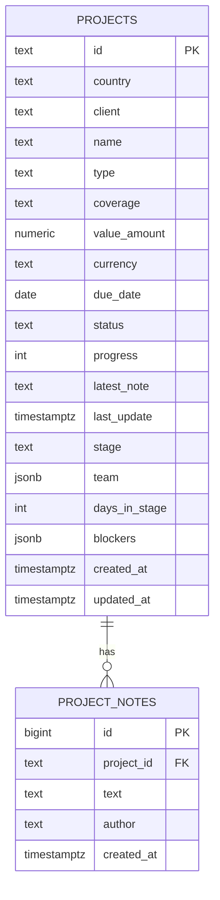

# DMS Data Model – Source of Truth (Updated)

Purpose: Central reference for the DMS (Document Management System) backend and database architecture with a focus on the Projects module. This document tracks schema definitions, migrations, services, runtime connectivity, and change history for the DMS domain.

## Scope

- New in this update:
  - DMS Projects persistence (tables `dms.projects`, `dms.project_notes`)
  - Backend services for projects CRUD and progress/status updates
  - Frontend integration, store hydration, and creation flow wiring
- Existing DMS areas (unchanged here): `folders`, `documents`, permissions, tags, storage provider.

## Conventions

- Schema prefix: `dms` for Document Management System tables
- Human-readable IDs: `projects.id` is a TEXT PK matching UI references (e.g., “MZ-2025-FAC-002”)
- Monetary values: persisted as `value_amount` (NUMERIC) + `currency` (TEXT), with a computed display (e.g., “$1,000,000”) returned by API
- Optimistic UI: status and progress updates apply rules (Done → 100%, Cancelled → 0%) and rollback on failure
- Notes: Latest note snapshot (`latest_note`, `last_update`) maintained on projects; full history in `dms.project_notes`

## Environment & Connectivity (Runtime)

- Connectors:
  - `req.pg` (Node pg Pool) for DMS Projects (direct PostgreSQL access to `dms.*` schema)
  - `req.supabase` (Supabase client) remains in use for DMS Folders/Documents and Storage
- Rationale:
  - Supabase Data API typically exposes `public` schema; `dms` isn’t exposed, so Projects uses `req.pg` to avoid API schema exposure requirements
- Env vars (Postgres): `SUPABASE_DB_URL` or `DATABASE_URL` preferred; SSL is negotiated and dev TLS verification relaxed where required (see [`pgMiddleware`](backend/src/middleware/pg.ts:1))
- Env vars (Supabase): `SUPABASE_URL`, `SUPABASE_SERVICE_ROLE_KEY` (server); `VITE_SUPABASE_URL`, `VITE_SUPABASE_ANON_KEY` (client)
- SPA catch‑all:
  - Avoid intercepting API routes by using a negative lookahead catch-all (see [`backend/src/index.ts`](backend/src/index.ts:58))

## Migrations & Seeding

- Migration file: [`backend/migrations/sql/015_dms_projects.sql`](backend/migrations/sql/015_dms_projects.sql:1)
  - Creates `dms` schema (if not exists)
  - Creates enum `dms.project_status` with values: Draft, Active, Pending Approval, In Progress, Done, Cancelled
  - Creates tables:
    - `dms.projects` (see Database Schema section)
    - `dms.project_notes`
  - Adds indexes for status/progress/dates and GIN indexes for JSON arrays
  - Adds `updated_at` trigger: `dms.set_timestamp_updated_at()`, `trg_projects_set_updated_at`
- Runner update: Migration included in script [`backend/scripts/migrate_app.ts`](backend/scripts/migrate_app.ts:35)
- Seeding: Service auto-seeds initial UI projects on first list request if the table is empty (see [`backend/src/routes/projects.ts`](backend/src/routes/projects.ts:89))

## Backend Architecture & Services (Projects API)

- Router: [`backend/src/routes/projects.ts`](backend/src/routes/projects.ts:1)
  - Uses `req.pg` to query `dms.*`
  - Endpoints (roles via [`authorize`](backend/src/middleware/rbac.ts:27)):
    - GET `/api/v1/dms/projects` (Viewer+)
      - Returns array of Project DTOs with formatted `value`
      - Auto-seeds 3 example projects on first call if DB is empty
    - POST `/api/v1/dms/projects` (Editor+)
      - Body includes UI payload (projectName, projectType, clientName, country, coverage, value, currency, dueDate, status, assignedTeam[])
      - Persists `value_amount` + `currency`; sets progress=0 and initializes arrays
    - PATCH `/api/v1/dms/projects/:id/status` (Editor+)
      - Updates `status`; applies rules:
        - `Done` → `progress = 100`
        - `Cancelled` → `progress = 0`
    - PATCH `/api/v1/dms/projects/:id/progress` (Editor+)
      - Updates `progress`
      - Optional `note` inserts into `dms.project_notes` and updates `latest_note`, `last_update`
    - POST `/api/v1/dms/projects/:id/notes` (Editor+)
      - Inserts note, updates `latest_note`, `last_update`
- Route mounting:
  - Mounted in [`backend/src/server.ts`](backend/src/server.ts:28) under `/api/v1/dms/projects`
- SPA catch‑all fix:
  - Ensure client-side routing catch‑all does not swallow API routes (see [`backend/src/index.ts`](backend/src/index.ts:58))

## Frontend Integration

- API service: [`src/lib/api/projects.ts`](src/lib/api/projects.ts:1)
  - Real HTTP endpoints wired:
    - `listProjects()`
    - `createProject(payload)`
    - `updateProjectStatus(id, status)`
    - `updateProjectProgress(id, percent, note?)`
    - `createProjectNote(id, text)`
- Store hydration: [`src/lib/store/projects.tsx`](src/lib/store/projects.tsx:38)
  - On mount, fetches projects via `listProjects()`; falls back to initial mock data on failure
- Create flow (UI):
  - [`src/pages/dms/Projects.tsx`](src/pages/dms/Projects.tsx:70) now calls `createProject(...)`
  - Adds created item to store with server response; error toasts on failure
- Dev server & alias:
  - Added Vite alias for '@/...' and dev proxy for `/api` to backend, including Socket.IO path; see [`vite.config.ts`](vite.config.ts:1)

## Database Schema (Current)

### Schema: `dms` – Projects

- `projects`
  - `id` TEXT PRIMARY KEY — human-readable project reference (UI-friendly)
  - `country` TEXT NOT NULL — e.g., "🇲🇿 Mozambique"
  - `client` TEXT NOT NULL
  - `name` TEXT NOT NULL
  - `type` TEXT NOT NULL CHECK (type IN ('Facultative','Treaty'))
  - `coverage` TEXT NOT NULL
  - `value_amount` NUMERIC(14,2) NOT NULL DEFAULT 0
  - `currency` TEXT NOT NULL CHECK (currency IN ('USD','EUR','GBP','ZAR'))
  - `due_date` DATE
  - `status` dms.project_status NOT NULL DEFAULT 'Active'
  - `progress` INTEGER NOT NULL DEFAULT 0 CHECK (progress BETWEEN 0 AND 100)
  - `latest_note` TEXT
  - `last_update` TIMESTAMPTZ
  - `stage` TEXT
  - `team` JSONB DEFAULT '[]'::jsonb
  - `days_in_stage` INTEGER DEFAULT 0
  - `blockers` JSONB DEFAULT '[]'::jsonb
  - `created_at` TIMESTAMPTZ NOT NULL DEFAULT NOW()
  - `updated_at` TIMESTAMPTZ NOT NULL DEFAULT NOW()
  - Indexes:
    - status, progress, created_at, updated_at, due_date
    - GIN(team), GIN(blockers)

- `project_notes`
  - `id` BIGSERIAL PRIMARY KEY
  - `project_id` TEXT REFERENCES dms.projects(id) ON DELETE CASCADE
  - `text` TEXT NOT NULL
  - `author` TEXT
  - `created_at` TIMESTAMPTZ NOT NULL DEFAULT NOW()
  - Indexes:
    - project_id

- Trigger
  - `dms.set_timestamp_updated_at()` (PL/pgSQL) and `trg_projects_set_updated_at` to maintain `updated_at` on update (see [`015_dms_projects.sql`](backend/migrations/sql/015_dms_projects.sql:1))

## ERD – DMS Projects

## Operational Notes

- Migrations:
  - Run: `npm run db:migrate:app` (see [`backend/scripts/migrate_app.ts`](backend/scripts/migrate_app.ts:1))
- Dev servers:
  - Vite: `npm run dev` (proxied `/api` to backend)
  - Backend: included in `npm run dev`, serves at `http://localhost:3000`
- Verification (examples):
  - List projects:
    - `curl -H "X-Role: viewer" http://localhost:3000/api/v1/dms/projects`
  - Create project:
    - `curl -X POST -H "Content-Type: application/json" -H "X-Role: editor" -d "{\"id\":\"PRJ-TEST-001\",\"projectName\":\"New Build\",\"projectType\":\"Facultative\",\"clientName\":\"Acme Corp\",\"country\":\"🇿🇦 South Africa\",\"coverage\":\"Property\",\"value\":1000000,\"currency\":\"USD\",\"dueDate\":\"2025-12-31\",\"status\":\"Active\"}" http://localhost:3000/api/v1/dms/projects`
  - Update status:
    - `curl -X PATCH -H "Content-Type: application/json" -H "X-Role: editor" -d "{\"status\":\"Done\"}" http://localhost:3000/api/v1/dms/projects/PRJ-TEST-001/status`
  - Update progress with note:
    - `curl -X PATCH -H "Content-Type: application/json" -H "X-Role: editor" -d "{\"progressPercent\":75,\"note\":\"Reached key milestone\"}" http://localhost:3000/api/v1/dms/projects/PRJ-TEST-001/progress`

## Change Log (DMS)

- v1.0 DMS Projects Persistence
  - Database:
    - Added `dms.project_status` enum
    - Added `dms.projects` and `dms.project_notes`
    - Indexes and `updated_at` trigger created
    - File: [`backend/migrations/sql/015_dms_projects.sql`](backend/migrations/sql/015_dms_projects.sql:1)
  - Migration runner:
    - Included `015_dms_projects.sql` in [`backend/scripts/migrate_app.ts`](backend/scripts/migrate_app.ts:35)
  - Backend:
    - New router: [`backend/src/routes/projects.ts`](backend/src/routes/projects.ts:1)
    - Mounted at: [`backend/src/server.ts`](backend/src/server.ts:28)
    - Catch‑all route fixed to not intercept API: [`backend/src/index.ts`](backend/src/index.ts:58)
  - Frontend:
    - Real HTTP API wired: [`src/lib/api/projects.ts`](src/lib/api/projects.ts:1)
    - Store hydration: [`src/lib/store/projects.tsx`](src/lib/store/projects.tsx:38)
    - Create flow wired: [`src/pages/dms/Projects.tsx`](src/pages/dms/Projects.tsx:70)
    - Vite alias and dev proxy added: [`vite.config.ts`](vite.config.ts:1)

## References

- Migrations:
  - [`015_dms_projects.sql`](backend/migrations/sql/015_dms_projects.sql:1)
  - Runner: [`migrate_app.ts`](backend/scripts/migrate_app.ts:35)
- Services:
  - Projects router: [`backend/src/routes/projects.ts`](backend/src/routes/projects.ts:1)
  - Route mount: [`backend/src/server.ts`](backend/src/server.ts:28)
  - Index SPA catch‑all: [`backend/src/index.ts`](backend/src/index.ts:58)
- Frontend:
  - API: [`src/lib/api/projects.ts`](src/lib/api/projects.ts:1)
  - Store: [`src/lib/store/projects.tsx`](src/lib/store/projects.tsx:38)
  - Page: [`src/pages/dms/Projects.tsx`](src/pages/dms/Projects.tsx:70)
  - Vite config: [`vite.config.ts`](vite.config.ts:1)
- Middleware:
  - PG Pool: [`backend/src/middleware/pg.ts`](backend/src/middleware/pg.ts:1)
  - RBAC: [`backend/src/middleware/rbac.ts`](backend/src/middleware/rbac.ts:27)
  - Supabase client: [`backend/src/middleware/supabase.ts`](backend/src/middleware/supabase.ts:31)